# Prompt Engineering System - 使用指南

## 目錄

- [概述](#概述)
  - [快速理解 - 核心概念圖](#快速理解---核心概念圖)
  - [系統優勢一覽](#系統優勢一覽)
- [架構設計](#架構設計)
  - [核心原則](#核心原則)
  - [整體架構圖](#整體架構圖)
  - [新舊架構對比](#新舊架構對比)
  - [目錄結構](#目錄結構)
- [使用方法](#使用方法)
  - [1. 基本使用 - 在 Agent 中建構 Prompt](#1-基本使用---在-agent-中建構-prompt)
  - [2. 自訂 Prompt Template](#2-自訂-prompt-template)
  - [3. 擴展領域知識庫](#3-擴展領域知識庫)
  - [4. Context Assembly 選項](#4-context-assembly-選項)
- [核心特性](#核心特性)
  - [1. 自動關鍵詞提取與相關上下文注入](#1-自動關鍵詞提取與相關上下文注入)
  - [2. State-Aware Prompting (狀態感知)](#2-state-aware-prompting-狀態感知)
  - [3. Multi-Hop Reasoning Support (多跳推理)](#3-multi-hop-reasoning-support-多跳推理)
  - [4. Token Budget Management](#4-token-budget-management)
- [與 LangGraph 工作流整合](#與-langgraph-工作流整合)
  - [完整工作流程圖](#完整工作流程圖)
  - [Context Assembly 在不同節點的配置](#context-assembly-在不同節點的配置)
  - [在工作流節點中使用](#在工作流節點中使用)
  - [Retry 機制整合](#retry-機制整合)
- [優勢對比](#優勢對比)
  - [相比 RAG 的優勢](#相比-rag-的優勢)
  - [RAG vs Prompt Engineering 流程對比](#rag-vs-prompt-engineering-流程對比)
  - [多跳推理範例](#多跳推理範例)
- [最佳實踐](#最佳實踐)
- [測試與驗證](#測試與驗證)
- [遷移指南](#遷移指南)
- [故障排除](#故障排除)
- [未來擴展](#未來擴展)
- [總結](#總結)

---

## 概述

本專案實現了一個先進的 Prompt Engineering 系統,通過豐富的上下文工程替代 RAG,實現更靈活的多跳推理能力,並與 LangGraph 工作流深度整合。

### 快速理解 - 核心概念圖

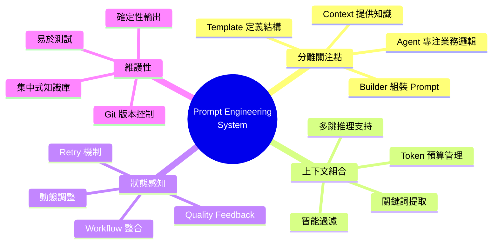

### 系統優勢一覽

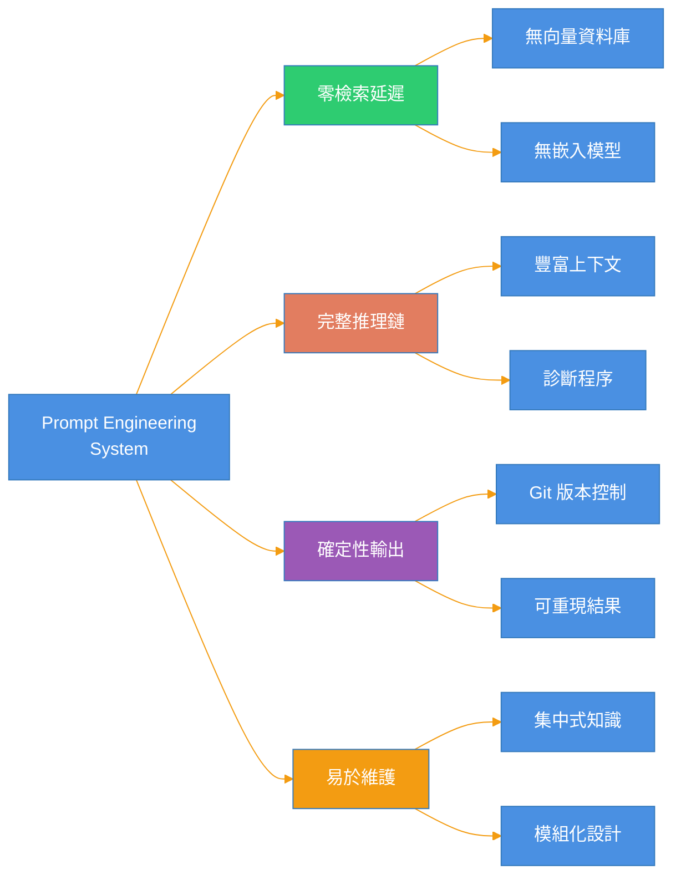

## 架構設計

### 核心原則

1. **關注點分離** - Prompt 管理與 Agent 業務邏輯解耦
2. **上下文組合** - 通過智能上下文組裝替代 RAG 檢索
3. **狀態感知** - Prompt 能夠根據工作流狀態動態調整
4. **可維護性** - 領域知識集中管理,支持版本控制

### 整體架構圖

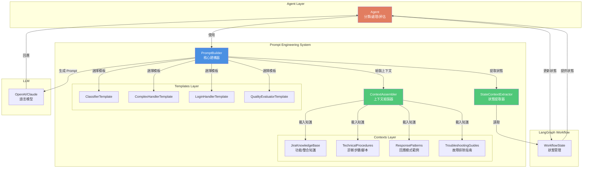

### 新舊架構對比

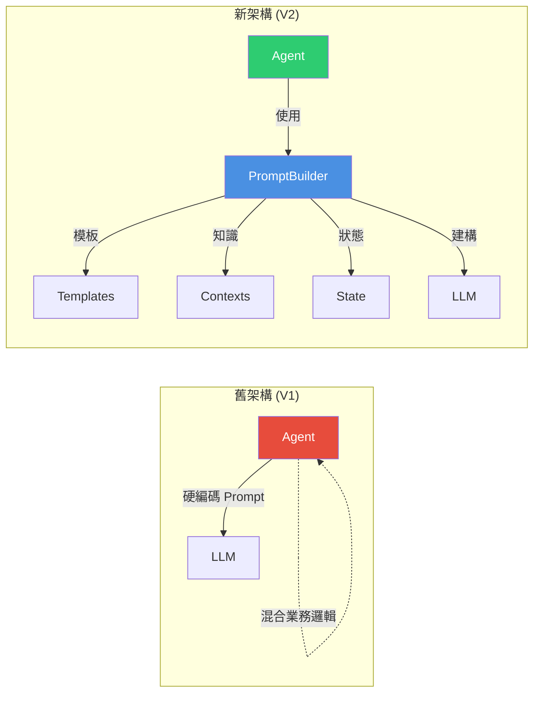

**V1 問題**:
- Prompt 與業務邏輯耦合
- 知識分散在各個 Agent
- 難以維護和測試
- 無法重用上下文

**V2 優勢**:
- 清晰的關注點分離
- 集中式知識管理
- 可測試、可重用
- 支持版本控制

### 目錄結構

```
src/prompts/
├── contexts/                          # 領域知識提供者
│   ├── jira-knowledge-base.ts        # Jira 功能、整合知識庫
│   ├── technical-procedures.ts       # 技術診斷步驟、腳本範例
│   ├── response-patterns.ts          # 回應模式與範例
│   └── troubleshooting-guides.ts     # 故障排除指南
├── templates/                         # Prompt 模板
│   ├── base-template.ts              # 基礎模板介面
│   ├── classifier.template.ts        # 分類器模板
│   ├── complex-handler.template.ts   # 複雜問題處理模板
│   ├── login-handler.template.ts     # 登入問題處理模板
│   └── quality-evaluator.template.ts # 品質評估模板
├── builders/                          # 建構器
│   ├── prompt-builder.ts             # 核心 Prompt 建構器
│   ├── context-assembler.ts          # 上下文組裝器
│   └── state-context-extractor.ts    # 狀態上下文提取器
└── index.ts                           # 統一導出
```

## 使用方法

### 1. 基本使用 - 在 Agent 中建構 Prompt

```typescript
import { PromptBuilder } from '../prompts/builders/prompt-builder';
import { complexHandlerTemplate } from '../prompts/templates/complex-handler.template';

async function generateResponse(
  state: WorkflowState,
  input: any
): Promise<AgentOutput> {
  // 建構 Prompt (自動注入相關上下文)
  const builtPrompt = PromptBuilder.build(
    complexHandlerTemplate,
    state,
    input,
    {
      contextOptions: {
        mode: 'relevant',  // 只包含相關知識
        includeExamples: true,
        includeTroubleshooting: true,
        includeTechnicalProcedures: true,
      },
      maxContextTokens: 8000,
    }
  );

  // 使用建構的 Prompt 呼叫 LLM
  const response = await openai.chat.completions.create({
    model: 'gpt-4',
    messages: [
      { role: 'system', content: builtPrompt.systemPrompt },
      { role: 'user', content: builtPrompt.userPrompt },
    ],
  });

  return response;
}
```

### 2. 自訂 Prompt Template

```typescript
import { BasePromptTemplate, PromptContext } from './base-template';

export class MyCustomTemplate extends BasePromptTemplate {
  id = 'my-custom.template';
  name = 'My Custom Template';
  version = '1.0.0';

  buildSystemPrompt(context?: PromptContext): string {
    const sections: string[] = [];

    sections.push('You are a specialized agent for...');

    // 注入領域知識
    if (context?.knowledgeBases?.jira) {
      sections.push('**Available Knowledge:**');
      // Format knowledge...
    }

    return sections.join('\n');
  }

  buildUserPrompt(input: any, context?: PromptContext): string {
    return `Process this input: ${JSON.stringify(input)}`;
  }

  getRequiredContexts(): string[] {
    return ['jira-knowledge-base', 'technical-procedures'];
  }
}
```

### 3. 擴展領域知識庫

#### 知識庫組織結構

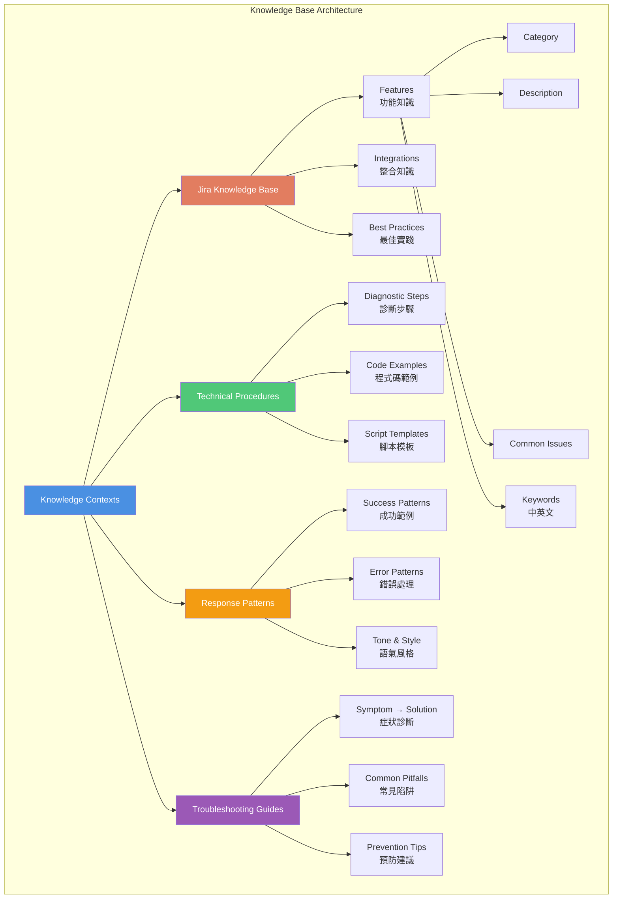

#### 關鍵詞匹配機制

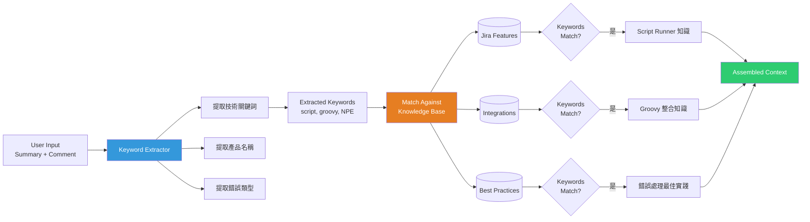

在 `src/prompts/contexts/` 中新增或修改知識庫:

```typescript
// jira-knowledge-base.ts
export const jiraKnowledgeBase: JiraKnowledgeContext = {
  features: [
    {
      category: 'New Feature Category',
      description: 'Description of the feature',
      commonIssues: [
        'Common problem 1',
        'Common problem 2',
      ],
      keywords: ['keyword1', 'keyword2', '關鍵詞'],
    },
    // ... more features
  ],
  integrations: [...],
  bestPractices: [...],
};
```

### 4. Context Assembly 選項

```typescript
// 預設配置 (minimal context)
CONTEXT_PRESETS.classifier = {
  mode: 'minimal',
  includeExamples: false,
  includeTroubleshooting: false,
  includeTechnicalProcedures: false,
};

// 豐富上下文 (for complex issues)
CONTEXT_PRESETS.complexHandler = {
  mode: 'relevant',  // 基於關鍵詞過濾
  includeExamples: true,
  includeTroubleshooting: true,
  includeTechnicalProcedures: true,
};

// 完整知識庫 (testing/debugging)
customOptions = {
  mode: 'full',  // 包含所有知識
  includeExamples: true,
  includeTroubleshooting: true,
  includeTechnicalProcedures: true,
};
```

## 核心特性

### 1. 自動關鍵詞提取與相關上下文注入

```typescript
// 系統自動從 issue 內容提取關鍵詞
const keywords = extractKeywords(summary, content);
// 結果: ['script runner', 'groovy', 'automation', 'NPE']

// 根據關鍵詞自動注入相關知識
const relevantKnowledge = getRelevantJiraKnowledge(keywords);
// 只包含與 Script Runner 相關的功能、整合、最佳實踐
```

### 2. State-Aware Prompting (狀態感知)

```typescript
// 系統自動檢測 retry 情況
if (state.retry_count > 0) {
  // 自動在 prompt 中加入:
  // - 上次的品質評分
  // - 改進建議
  // - 上次的回應 (供參考)
}
```

### 3. Multi-Hop Reasoning Support (多跳推理)

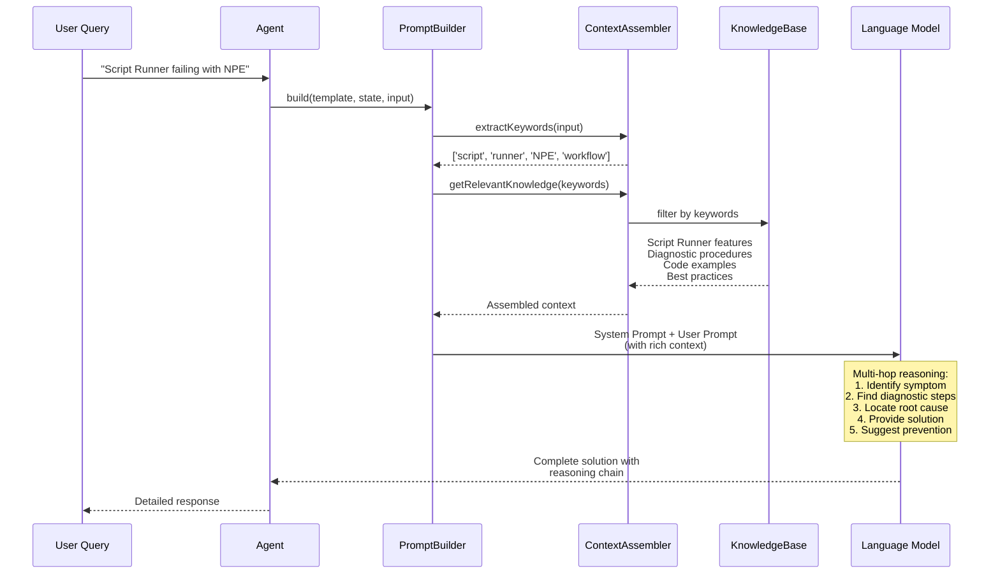

不使用 RAG,而是通過豐富的結構化知識支持多跳推理:

```typescript
// 知識庫包含完整的診斷鏈
diagnosticProcedures: [
  {
    symptom: 'Script Runner post-function failing',
    steps: [
      '1. Check logs for stack trace',
      '2. Identify null pointer line',
      '3. Add null checks',
      '4. Test in Script Console',
      // ... complete chain
    ],
  }
]
```

LLM 可以:
1. 識別症狀 → 找到相關診斷程序
2. 執行診斷步驟 → 識別根本原因
3. 根據根本原因 → 提供解決方案
4. 提供預防措施 → 避免未來問題

### 4. Token Budget Management

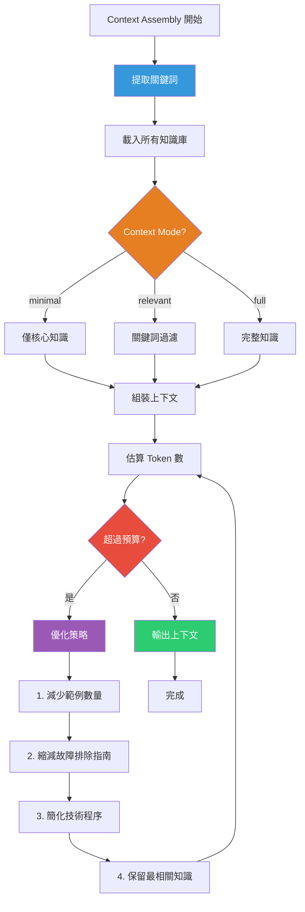

```typescript
// 自動優化上下文以符合 token 預算
const optimized = ContextAssembler.optimizeForTokenBudget(
  context,
  maxTokens: 8000
);

// 優化策略:
// 1. 減少回應範例
// 2. 減少故障排除指南
// 3. 減少技術程序
// 保留最相關的知識
```

## 與 LangGraph 工作流整合

### 完整工作流程圖

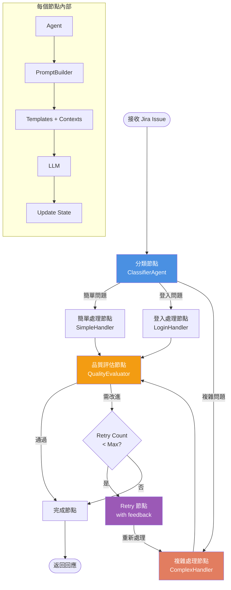

### Context Assembly 在不同節點的配置

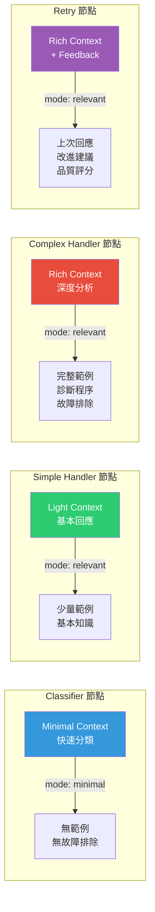

### 在工作流節點中使用

```typescript
// workflow/graph.ts
import { ProblemClassificationAgentV2 } from '../agents/classifier-v2';

const classificationAgent = new ProblemClassificationAgentV2();

async function classifyNode(state: WorkflowState) {
  // Agent 內部使用 PromptBuilder
  return await classificationAgent.classify(state);
}
```

### Retry 機制整合

當品質評估要求 retry 時:

```typescript
// graph.ts
function routeAfterQuality(state: WorkflowState): string {
  if (state.next_action === 'improve_response') {
    if (state.retry_count < state.max_retries) {
      // 系統會自動在 prompt 中注入:
      // - quality_feedback
      // - improvement_suggestions
      // - previous_response
      return 'retry_complex';
    }
  }
  return 'finalize';
}
```

## 優勢對比

### 相比 RAG 的優勢

| 特性 | RAG | Prompt Engineering System |
|------|-----|---------------------------|
| **延遲** | 需要檢索步驟 (+200-500ms) | 零檢索延遲 |
| **準確性** | 可能檢索不相關內容 | 基於關鍵詞精確過濾 |
| **多跳推理** | 困難,需要多次檢索 | 原生支持,完整上下文 |
| **可控性** | 難以控制檢索結果 | 完全可控的上下文組裝 |
| **可測試性** | 難以測試檢索品質 | 確定性,易於測試 |
| **版本控制** | 需要管理向量資料庫 | Git 版本控制 |
| **成本** | 需要嵌入模型 + 向量 DB | 僅 LLM 推理成本 |

### RAG vs Prompt Engineering 流程對比

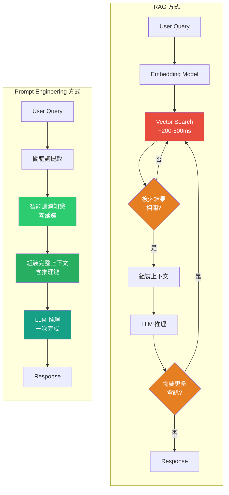

**關鍵差異**:
- **RAG**: 可能需要多次檢索,延遲累加,結果不確定
- **Prompt Engineering**: 一次性提供完整上下文,零檢索延遲,確定性輸出

### 多跳推理範例

**問題**: "Script Runner 腳本在 workflow transition 時拋出 NullPointerException,如何解決?"

**RAG 方式**:
1. 檢索 "NullPointerException" → 可能得到通用 Java NPE 資訊
2. 需要第二次檢索 "Script Runner debugging" → 可能遺漏 workflow 上下文
3. 難以連接 "腳本錯誤" → "工作流配置" → "權限問題" 的推理鏈

**Prompt Engineering 方式**:
```
System Prompt 包含:
1. Script Runner 知識 (完整上下文)
2. Workflow 配置知識
3. 診斷程序: NPE → 檢查 logs → 識別 null object → 驗證權限
4. 程式碼範例: 如何加入 null checks
5. 最佳實踐: 在 Script Console 測試

LLM 可以直接進行完整推理鏈:
症狀識別 → 日誌分析 → 根因定位 → 程式碼修復 → 測試建議 → 預防措施
```

## 最佳實踐

### 1. 領域知識維護

```typescript
// ✅ 好的做法: 結構化、詳細的知識
{
  category: 'Script Runner',
  description: 'Groovy scripting automation...',
  commonIssues: [
    'NullPointerException in custom scripts',  // 具體
    'Script console access denied',             // 可操作
  ],
  keywords: ['script', 'groovy', 'automation', '腳本'],  // 多語言
}

// ❌ 避免: 模糊、不完整的知識
{
  category: 'Automation',
  description: 'Various automation features',
  commonIssues: ['Problems with automation'],
  keywords: ['auto'],
}
```

### 2. Template 設計

```typescript
// ✅ 好的做法: 模組化、可組合
buildSystemPrompt(context?: PromptContext): string {
  const sections: string[] = [];
  sections.push(this.buildRoleDefinition());
  sections.push(this.buildDomainKnowledge(context));
  sections.push(this.buildResponseGuidelines());
  return sections.join('\n');
}

// ❌ 避免: 單一巨大字串
buildSystemPrompt(): string {
  return `Very long hardcoded prompt...`;
}
```

### 3. Context Assembly

```typescript
// ✅ 好的做法: 根據 agent 類型調整
classifier: { mode: 'minimal', includeExamples: false }
complexHandler: { mode: 'relevant', includeExamples: true }

// ❌ 避免: 所有 agent 使用相同配置
allAgents: { mode: 'full' }  // 浪費 tokens
```

## 測試與驗證

### 1. 測試 Prompt Template

```typescript
import { classifierTemplate } from './templates/classifier.template';

// 測試基本 prompt 建構
const minimal = PromptBuilder.buildMinimal(
  classifierTemplate,
  { summary: 'Test', comment: 'Test' }
);

console.log(minimal.systemPrompt);
console.log(minimal.userPrompt);
```

### 2. 測試 Context Assembly

```typescript
import { ContextAssembler } from './builders/context-assembler';

const context = ContextAssembler.assemble(
  state,
  'complexHandler',
  { mode: 'relevant' }
);

const formatted = ContextAssembler.formatContextForPrompt(context);
console.log('Formatted context:', formatted);

const tokens = ContextAssembler.estimateTokens(context);
console.log('Estimated tokens:', tokens);
```

### 3. 驗證關鍵詞提取

```typescript
import { extractKeywords } from './contexts/jira-knowledge-base';

const keywords = extractKeywords(
  'Script Runner automation failing',
  'Getting NullPointerException in workflow'
);
console.log('Extracted keywords:', keywords);
// ['script', 'automation', 'workflow', 'runner']
```

## 遷移指南

### 從舊 Agent 遷移到新系統

1. **保留原有 Agent** (作為備份)
2. **建立 V2 Agent** 使用新系統
3. **並行測試** 比較輸出品質
4. **逐步切換** 在工作流中啟用 V2

```typescript
// graph.ts
const USE_V2_AGENTS = process.env.USE_V2_AGENTS === 'true';

const classificationAgent = USE_V2_AGENTS
  ? new ProblemClassificationAgentV2()
  : new ProblemClassificationAgent();
```

## 故障排除

### Prompt 太長超過 token 限制

```typescript
// 方案 1: 降低 maxContextTokens
const builtPrompt = PromptBuilder.build(template, state, input, {
  maxContextTokens: 4000,  // 減少從 8000
});

// 方案 2: 使用 minimal mode
const builtPrompt = PromptBuilder.build(template, state, input, {
  contextOptions: { mode: 'minimal' },
});

// 方案 3: 關閉某些上下文
const builtPrompt = PromptBuilder.build(template, state, input, {
  contextOptions: {
    includeExamples: false,
    includeTroubleshooting: false,
  },
});
```

### 關鍵詞提取不準確

```typescript
// 擴展關鍵詞清單
export const jiraKnowledgeBase = {
  features: [
    {
      category: 'Script Runner',
      keywords: [
        'script', 'groovy', 'automation',
        '腳本', '自動化',  // 中文
        'scriptrunner', 'script-runner',  // 變體
      ],
    },
  ],
};
```

### Retry 沒有改進

檢查 quality feedback 是否具體:

```typescript
// ❌ 不夠具體
improvement_suggestions: ['Improve response quality']

// ✅ 具體可操作
improvement_suggestions: [
  'Add specific step-by-step instructions for password reset',
  'Include code example for null check in Groovy script',
  'Provide alternative solution if LDAP sync fails',
]
```

## 未來擴展

1. **動態知識更新** - 從 Atlassian 文件自動更新知識庫
2. **A/B Testing** - 測試不同 prompt 版本的效果
3. **Prompt Analytics** - 追蹤哪些知識最常被使用
4. **Multi-language Support** - 擴展到其他語言的知識庫
5. **Custom Context Providers** - 允許專案特定的上下文

## 總結

這個 Prompt Engineering 系統提供了:

✅ **解耦** - Prompt 與業務邏輯分離
✅ **可維護** - 領域知識集中管理
✅ **靈活** - 支持多跳推理,無需 RAG
✅ **狀態感知** - 與 LangGraph 深度整合
✅ **高效** - 零檢索延遲,確定性輸出
✅ **可測試** - 完全可控,易於驗證

通過豐富的上下文工程,我們達到甚至超越 RAG 的能力,同時保持更好的可控性和可維護性。
