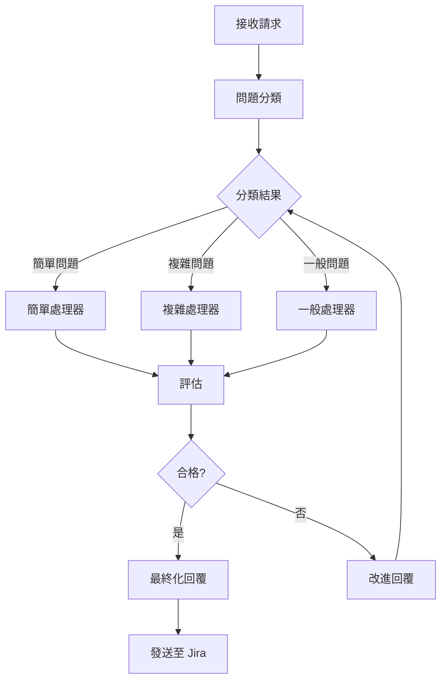

# JiraCSServer v2.0

> Next.js + TypeScript 驅動的 Jira 客服智能工作流系統

[](https://www.typescriptlang.org/)
[](https://nextjs.org/)
[](https://reactjs.org/)
[](https://pnpm.io/)
[](https://github.com/langchain-ai/langgraph)
[](https://nodejs.org/)
[](https://www.docker.com/)

## 📋 目錄

- [簡介](#簡介)
- [核心功能](#核心功能)
- [技術棧](#技術棧)
- [系統架構](#系統架構)
- [快速開始](#快速開始)
- [API 文檔](#api-文檔)
- [配置說明](#配置說明)
- [開發指南](#開發指南)
- [測試](#測試)
- [部署](#部署)
- [故障排除](#故障排除)
- [性能優化](#性能優化)

## 簡介

JiraCSServer v2.0 是一個基於 AI 的 Jira 客戶服務自動化系統，使用 Next.js 15 和 TypeScript 5.7 構建，採用 LangGraph 進行多代理工作流編排。系統能夠自動分類問題、生成專業回覆，並支持批量處理工單。

### v2.0 主要特性

- ✅ **Next.js 15 + App Router** - 現代化的全棧框架，採用最新的 React Server Components
- ✅ **TypeScript 5.7** - 完整類型安全，包含路徑別名
- ✅ **React 19** - 最新的 React 版本
- ✅ **pnpm 管理** - 高效的依賴管理和 monorepo 支持
- ✅ **多空間支持** - corp, confluence, ext, jira 專屬配置
- ✅ **智能分類** - AI 驅動的問題分類系統（簡單/一般/複雜）
- ✅ **批量處理** - 並行或順序處理多個工單
- ✅ **質量評估** - 自動評估回覆質量並優化
- ✅ **Docker 部署** - 完整的容器化方案，包含 Nginx 反向代理
- ✅ **測試模式** - 內建 Mock 模式用於開發測試
- ✅ **健康檢查** - 多層級健康檢查機制
- ✅ **測試工具** - Python 和 Bash 測試腳本
- ✅ **LangMem 整合** - LangGraph 原生記憶體管理,自動維護對話上下文

## 核心功能

### 1. 多空間問題類型系統

根據不同的空間（corp, confluence, ext, jira）提供專屬的請求類型：

```typescript
// Jira 專屬
- 欄位設置 (Field Setup)
- 工作流程 (Workflow)

// Confluence/Ext 專屬
- 新賬號授權 (New Account)

// 所有空間通用
- 登入問題 (Login)
- 權限管理 (Permission)
- 新空間申請 (New Space)
- 咨詢 (Consultation)
- 許願池 (Wish Pool)
- 其他 (Other)
```

### 2. 智能工作流

系統採用 LangGraph 構建的多代理工作流：



**工作流特點：**
- 智能問題分類（基於複雜度和類型）
- 專門的處理器針對不同問題類型
- 質量評估和自動改進機制
- 完整的錯誤處理和重試邏輯

### 3. LangMem 對話上下文管理

系統使用 **LangGraph 的原生 LangMem** 進行自動化對話上下文持久化：

**核心特性：**
- ✅ **自動狀態保存** - 每個節點執行後自動保存工作流狀態
- ✅ **Thread-based 隔離** - 使用 Project ID 作為 thread_id，同一專案共享上下文
- ✅ **零配置記憶** - 無需手動保存/加載上下文，LangGraph 自動處理
- ✅ **PostgreSQL 後端** - 使用 checkpoint 表存儲對話歷史
- ✅ **版本控制** - 每個 checkpoint 有唯一 ID，支持時間旅行調試

**工作原理：**
```typescript
// 第一次互動
processRequest({ "Project ID": "JCSC-1", ... })
// → thread_id: "project:JCSC-1"
// → LangMem 自動保存狀態

// 後續追問（相同 Project ID）
processRequest({ "Project ID": "JCSC-1", ... })
// → 相同 thread_id
// → LangMem 自動加載之前的上下文
// → 實現對話連續性
```

詳細文檔請參閱 [LANGMEM_GUIDE.md](./LANGMEM_GUIDE.md)

### 4. API 端點

#### 核心端點

| 端點 | 方法 | 描述 |
|------|------|------|
| `/api/jira/process` | POST | 處理單一工單並發送至 Jira |
| `/api/jira/process_test` | POST | 處理工單但不發送（測試用） |
| `/api/jira/batch` | POST | 批量處理工單 |
| `/api/jira/health` | GET | 詳細健康檢查 |
| `/api/jira/info` | GET | 系統信息和 API 限制 |
| `/health` | GET | 基本健康檢查 |

詳細 API 文檔請參閱 [API.md](./API.md)

## 技術棧

### 前端/框架
- **Next.js 15.1** - React 全棧框架，採用 App Router
- **TypeScript 5.7** - 類型安全，strict 模式
- **React 19** - 最新的 React 版本
- **React DOM 19** - DOM 渲染

### 後端/AI
- **@langchain/langgraph 0.4.9** - 工作流編排
- **@langchain/core 0.3.78** - AI 鏈工具
- **@langchain/openai 0.6.15** - OpenAI 集成
- **OpenAI 6.3** - LLM 服務客戶端

### 工具庫
- **Axios 1.7.9** - HTTP 客戶端
- **UUID 13** - 唯一 ID 生成
- **Joi 18** - 數據驗證
- **dotenv 17** - 環境變數管理

### 中間件/安全
- **Helmet 8** - 安全標頭
- **CORS 2.8** - 跨域支持
- **Morgan 1.10** - HTTP 請求日誌

### 構建/工具
- **pnpm 10.16** - 套件管理器
- **Node.js 24** - 運行環境（Alpine）
- **ts-node 10** - TypeScript 執行器
- **Express 5** - HTTP 服務器（可選）

### 基礎設施
- **Docker** - 容器化部署（多階段構建）
- **Nginx** - 反向代理和負載均衡
- **Docker Compose** - 容器編排

## 系統架構

```
JiraCSServer/
├── app/                      # Next.js App Router
│   ├── api/jira/
│   │   ├── process/         # 單一處理端點（發送至 Jira）
│   │   │   └── route.ts
│   │   ├── process_test/    # 測試處理端點（不發送）
│   │   │   └── route.ts
│   │   ├── batch/           # 批量處理端點
│   │   │   └── route.ts
│   │   ├── health/          # 詳細健康檢查
│   │   │   └── route.ts
│   │   └── info/            # 系統信息
│   │       └── route.ts
│   └── health/              # 基本健康檢查
│       └── route.ts
├── src/
│   ├── agents/              # AI 代理
│   │   ├── classifier.ts           # 問題分類器
│   │   ├── login-handler.ts        # 登入處理器
│   │   ├── complex-handler.ts      # 複雜問題處理器
│   │   ├── general-handler.ts      # 一般問題處理器
│   │   ├── quality-evaluator.ts    # 質量評估器
│   │   ├── mock-classifier.ts      # Mock 分類器（測試用）
│   │   ├── mock-handlers.ts        # Mock 處理器（測試用）
│   │   └── mock-quality-evaluator.ts # Mock 評估器（測試用）
│   ├── workflow/            # 工作流編排
│   │   ├── orchestrator.ts         # 主編排器（統一接口）
│   │   ├── graph.ts               # LangGraph 圖定義
│   │   └── state.ts               # 狀態類型定義
│   ├── types/               # TypeScript 類型
│   │   ├── index.ts               # 核心類型定義
│   │   └── extended.ts            # 擴展類型（請求類型等）
│   ├── clients/             # 外部客戶端
│   │   └── jira-client.ts         # Jira API 客戶端
│   ├── routes/              # Express 路由（可選）
│   │   └── jira.ts                # Jira 路由定義
│   ├── tests/               # 測試文件
│   │   ├── index.ts               # 基本測試
│   │   ├── api-test.ts            # API 端點測試
│   │   └── mock-data.ts           # Mock 測試數據
│   └── utils/               # 工具函數
│       └── config.ts              # 配置管理
├── nginx/                   # Nginx 配置
│   ├── nginx.conf                 # 主配置
│   ├── conf.d/
│   │   └── jira-cs-server.conf   # 服務配置
│   └── logs/                      # 日誌目錄
├── Dockerfile               # Docker 構建文件（多階段）
├── docker-compose.yml       # Docker Compose 配置
├── next.config.mjs          # Next.js 配置
├── tsconfig.json            # TypeScript 配置
├── package.json             # 依賴配置
├── pnpm-lock.yaml           # 鎖定文件
├── pnpm-workspace.yaml      # pnpm 工作區
├── .env.example             # 環境變數範例
├── test-payload.json        # 測試數據
├── test-endpoints.py        # Python 測試腳本
├── test-all-endpoints.sh    # Bash 測試腳本
├── deploy.sh                # 部署腳本
├── API.md                   # API 詳細文檔
├── DEPLOYMENT.md            # 部署指南
├── TEST_GUIDE.md            # 測試指南
└── IMPLEMENTATION_SUMMARY.md # 實施總結
```

### 架構特點

1. **Next.js App Router**: 採用最新的 App Router 模式，支持 Server Components
2. **TypeScript 路徑別名**: 配置了 `@/*` 等別名，方便模組導入
3. **模組化設計**: Agent、Workflow、Client 分離
4. **測試友好**: Mock 實現和實際實現分離
5. **容器化**: Docker 多階段構建，優化映像大小

## 快速開始

### ⚠️ 重要:必須在 WSL 環境中開發

**本項目的所有開發操作必須在 WSL (Windows Subsystem for Linux) 中進行!**

請勿在 Windows PowerShell 或 CMD 中運行任何 npm/git 命令。詳細說明請參閱 [CLAUDE.md](./CLAUDE.md)

### 前置要求

- **WSL 2** (Ubuntu 20.04+ 推薦)
- **Node.js** >= 18.0.0 (推薦使用 24.x LTS)
- **npm** 或 **pnpm** >= 9.0.0
- **PostgreSQL** >= 14 (用於上下文存儲系統)
- **Docker** (可選,用於運行 PostgreSQL)
- **OpenAI API Key** (或兼容的 API，如 Google Gemini)
- **Jira 實例訪問權限**

### 快速設置 (推薦)

```bash
# 1. 在 Windows 中打開 WSL
wsl

# 2. 導航到項目目錄
cd /mnt/c/Users/ALVIS.MC.TSAO/worKspace/JiraCSServer

# 3. 運行自動設置腳本
chmod +x setup-wsl.sh
./setup-wsl.sh
```

### 手動安裝

```bash
# ===在 WSL 中執行以下所有命令===

# 1. 克隆倉庫
git clone https://github.com/your-org/JiraCSServer.git
cd JiraCSServer

# 2. 安裝依賴
npm install
# 或使用 pnpm
pnpm install

# 3. 配置環境變數
cp .env.example .env
# 使用 WSL 編輯器編輯
nano .env  # 或 vim .env

# 4. 設置 PostgreSQL (使用 Docker)
docker run --name jira-cs-postgres \
  -e POSTGRES_PASSWORD=your_password \
  -e POSTGRES_DB=jira_cs \
  -p 5432:5432 \
  -d postgres:16

# 5. 初始化資料庫
npm run db:init

# 6. 驗證設置
npm run db:stats
```

### 環境變數配置

編輯 `.env` 文件：

```env
# OpenAI Configuration
OPENAI_API_KEY=your_openai_api_key_here
OPENAI_MODEL=gpt-4o
OPENAI_BASE_URL=https://api.openai.com/v1

# 或使用 Google Gemini
# OPENAI_MODEL=gemini-flash-latest
# OPENAI_BASE_URL=https://generativelanguage.googleapis.com/v1beta/openai/

# Jira Configuration
JIRA_BASE_URL=https://jirastage.deltaww.com
JIRA_AUTH_TOKEN=YWx2aXMuYWRtaW46UGFyYTk0Nzg=

# Application Configuration
NODE_ENV=development
PORT=3000
LOG_LEVEL=info

# CORS Configuration
CORS_ORIGINS=http://localhost:3000,https://yourdomain.com

# Testing Configuration
TEST_MODE=false
```

**重要說明：**
- `JIRA_AUTH_TOKEN`: Base64 編碼的 `username:password`
- `OPENAI_BASE_URL`: 支持兼容 OpenAI API 的服務
- `TEST_MODE`: 設為 `true` 時使用 Mock 模式

### 開發模式

```bash
# 啟動 Next.js 開發服務器
pnpm dev

# 服務器運行在:
# - http://localhost:3000
# - API: http://localhost:3000/api/jira
```

### 驗證安裝

```bash
# 健康檢查
curl http://localhost:3000/health

# 詳細健康檢查
curl http://localhost:3000/api/jira/health

# 系統信息
curl http://localhost:3000/api/jira/info
```

### 生產構建

```bash
# 構建應用
pnpm build

# 啟動生產服務器
pnpm start:prod
```

## API 文檔

完整的 API 文檔請參閱 [API.md](./API.md)

### 核心 API 概覽

#### 1. POST /api/jira/process

處理單一工單並發送評論至 Jira。

**基本請求：**

```json
{
  "forms": {
    "Project ID": "JCSC-123",
    "Issue Type": "Support Request",
    "Reporter": "john.doe",
    "Created": "2025/10/13 10:00",
    "Updated": "2025/10/13 10:00",
    "Summary": "無法登入系統",
    "Space Type": "jira",
    "Request Type": "login",
    "Comment": {
      "Content": "我嘗試用公司帳號登入，但一直顯示錯誤..."
    }
  }
}
```

**回應：**

```json
{
  "success": true,
  "data": {
    "issue_key": "JCSC-123",
    "comment_content": "您好！關於您的登入問題...",
    "classification": {
      "category": "JIRA_SIMPLE",
      "confidence": 0.95
    },
    "quality_score": 92,
    "processing_time": 2345
  }
}
```

#### 2. POST /api/jira/process_test

與 `/api/jira/process` 相同，但不會發送評論至 Jira（用於測試）。

#### 3. POST /api/jira/batch

批量處理多個工單。

```json
{
  "issues": [
    { "forms": { /* issue 1 */ } },
    { "forms": { /* issue 2 */ } }
  ],
  "options": {
    "parallel": true,
    "max_concurrent": 5
  }
}
```

#### 4. GET /api/jira/health

詳細健康檢查，包含組件狀態、記憶體使用等。

#### 5. GET /api/jira/info

獲取系統信息、版本和 API 限制。

## 配置說明

### 請求類型配置

項目支持多種請求類型，根據空間類型進行過濾。配置位於 [src/types/extended.ts](./src/types/extended.ts)。

```typescript
import { SPACE_REQUEST_TYPE_MAP, RequestType } from '@/types/extended';

// 檢查 Jira 是否支持欄位設置
const supportsFieldSetup = SPACE_REQUEST_TYPE_MAP['jira']
  .includes(RequestType.FIELD_SETUP); // true

// Confluence 不支持欄位設置
const confSupports = SPACE_REQUEST_TYPE_MAP['confluence']
  .includes(RequestType.FIELD_SETUP); // false
```

### 欄位驗證規則

每種請求類型都有對應的欄位配置：

```typescript
import { REQUEST_TYPE_FIELD_CONFIG } from '@/types/extended';

const config = REQUEST_TYPE_FIELD_CONFIG[RequestType.NEW_ACCOUNT];

console.log(config.required_fields);
// ['Reporter', 'Space Type', 'User Signature']

console.log(config.validation_rules);
// { space_type: ['confluence', 'ext'] }

console.log(config.handler_type);
// 'general' - 使用哪個處理器
```

### TypeScript 路徑別名

項目配置了以下路徑別名（[tsconfig.json](./tsconfig.json)）：

```json
{
  "@/*": ["./src/*"],
  "@types/*": ["./src/types/*"],
  "@agents/*": ["./src/agents/*"],
  "@workflow/*": ["./src/workflow/*"],
  "@clients/*": ["./src/clients/*"],
  "@utils/*": ["./src/utils/*"]
}
```

使用範例：

```typescript
import { JiraClient } from '@/clients/jira-client';
import { RequestType } from '@types/extended';
import { ClassifierAgent } from '@agents/classifier';
```

### Next.js 配置

項目配置了以下優化（[next.config.mjs](./next.config.mjs)）：

- **React Strict Mode**: 開啟
- **SWC 最小化**: 提升構建速度
- **Gzip 壓縮**: 減小傳輸大小
- **Standalone 輸出**: 包含所有依賴，方便部署
- **環境變數注入**: 自動注入環境變數
- **Webpack 優化**: 排除不必要的服務端依賴

## 開發指南

### 添加新的請求類型

1. **定義類型** - 在 [src/types/extended.ts](./src/types/extended.ts) 中添加：

```typescript
export enum RequestType {
  // ... 現有類型
  NEW_TYPE = 'new_type',
}
```

2. **配置空間映射**：

```typescript
export const SPACE_REQUEST_TYPE_MAP: Record<SpaceType, RequestType[]> = {
  jira: [
    // ... 現有類型
    RequestType.NEW_TYPE,
  ],
  // 其他空間...
};
```

3. **配置欄位規則**：

```typescript
export const REQUEST_TYPE_FIELD_CONFIG: Record<RequestType, RequestTypeFieldConfig> = {
  [RequestType.NEW_TYPE]: {
    required_fields: ['field1', 'field2'],
    optional_fields: ['field3'],
    validation_rules: {
      space_type: ['jira'], // 限制適用的空間
    },
    handler_type: 'complex', // simple | general | complex
  },
};
```

### 添加新的 Agent

1. **創建 Agent 文件**：

```typescript
// src/agents/new-handler.ts
import type { WorkflowState } from '@workflow/state';

export class NewHandlerAgent {
  async handle(state: WorkflowState): Promise<Partial<WorkflowState>> {
    console.log('[NewHandler] Processing:', state.issue_key);

    // 處理邏輯
    const result = await this.processIssue(state);

    return {
      comment_content: result,
      processing_agent: 'new_handler',
    };
  }

  private async processIssue(state: WorkflowState): Promise<string> {
    // 實際處理邏輯
    return 'Generated response';
  }
}
```

2. **在編排器中註冊**：

```typescript
// src/workflow/orchestrator.ts
import { NewHandlerAgent } from '@agents/new-handler';

export class WorkflowOrchestrator {
  private newHandler: NewHandlerAgent;

  constructor() {
    this.newHandler = new NewHandlerAgent();
    // ...
  }

  async processIssue(input: any) {
    // ... 在適當的地方調用
    if (needsNewHandler) {
      const result = await this.newHandler.handle(state);
    }
  }
}
```

3. **添加 Mock 版本**（用於測試）：

```typescript
// src/agents/mock-new-handler.ts
export class MockNewHandlerAgent {
  async handle(state: WorkflowState): Promise<Partial<WorkflowState>> {
    return {
      comment_content: 'Mock response',
      processing_agent: 'mock_new_handler',
    };
  }
}
```

### 修改工作流邏輯

工作流定義在 [src/workflow/graph.ts](./src/workflow/graph.ts)，使用 LangGraph：

```typescript
import { StateGraph } from "@langchain/langgraph";

const workflow = new StateGraph({...})
  .addNode("classify", classifyNode)
  .addNode("handle_simple", handleSimpleNode)
  .addNode("handle_complex", handleComplexNode)
  .addConditionalEdges(
    "classify",
    routeByClassification,
    {
      simple: "handle_simple",
      complex: "handle_complex",
    }
  );
```

### 代碼風格

- 使用 TypeScript strict 模式
- 優先使用 `async/await` 而非 Promise chain
- 使用路徑別名 (`@/...`) 導入模組
- 添加適當的類型註解
- 使用 `console.log` 記錄關鍵步驟

## 測試

完整的測試指南請參閱 [TEST_GUIDE.md](./TEST_GUIDE.md)

### 內建測試

```bash
# 基本測試
pnpm test

# Mock 模式測試（不調用實際 API）
pnpm test:mock

# API 端點測試
pnpm test:api
```

### 使用測試腳本

#### Python 測試腳本

```bash
# 測試所有端點
python test-endpoints.py

# 需要安裝 requests
pip install requests
```

#### Bash 測試腳本

```bash
# 賦予執行權限
chmod +x test-all-endpoints.sh

# 運行測試
./test-all-endpoints.sh
```

### 測試數據

項目包含測試數據文件 [test-payload.json](./test-payload.json)：

```bash
# 使用測試數據測試處理端點
curl -X POST http://localhost:3000/api/jira/process_test \
  -H "Content-Type: application/json" \
  -d @test-payload.json
```

### Mock 模式

設置 `TEST_MODE=true` 啟用 Mock 模式：

```bash
# 啟動 Mock 模式
TEST_MODE=true pnpm dev

# 或在 .env 文件中設置
echo "TEST_MODE=true" >> .env
```

Mock 模式特點：
- 不調用實際的 OpenAI API
- 不發送評論至 Jira
- 返回預定義的測試響應
- 適合開發和測試

## 部署

完整的部署指南請參閱 [DEPLOYMENT.md](./DEPLOYMENT.md)

### Docker Compose 部署（推薦）

這是最簡單的部署方式，包含 Next.js 應用和 Nginx 反向代理。

```bash
# 1. 配置環境變數
cp .env.example .env
nano .env

# 2. 啟動所有服務
docker-compose up -d

# 3. 查看日誌
docker-compose logs -f

# 4. 查看服務狀態
docker-compose ps
```

**服務架構：**
- **jira-cs-server**: Next.js 應用（端口 3000）
- **nginx**: 反向代理（端口 80, 8080）

**訪問服務：**
- 端口 80: `http://your-server-ip/api/jira/process`
- 端口 8080: `http://your-server-ip:8080/api/jira/process`
- 端口 3000: 直接訪問（僅用於調試）

### 使用部署腳本

```bash
# 賦予執行權限
chmod +x deploy.sh

# 運行部署
./deploy.sh
```

### 手動 Docker 部署

```bash
# 1. 構建映像
docker build -t jiracsserver:latest .

# 2. 運行容器
docker run -d \
  --name jiracsserver \
  --restart unless-stopped \
  -p 3000:3000 \
  --env-file .env \
  jiracsserver:latest

# 3. 查看日誌
docker logs -f jiracsserver
```

### Dockerfile 特性

項目使用多階段構建優化映像大小：

1. **base 階段**: Node.js 24 Alpine + pnpm
2. **deps 階段**: 安裝依賴
3. **builder 階段**: 構建應用
4. **runner 階段**: 最小化運行環境

**優化特點：**
- 使用 Alpine Linux（體積小）
- 只包含生產依賴
- 非 Root 用戶運行（安全）
- 內建健康檢查
- standalone 輸出模式

### Nginx 配置

項目包含完整的 Nginx 配置：

- **主配置**: [nginx/nginx.conf](./nginx/nginx.conf)
- **服務配置**: [nginx/conf.d/jira-cs-server.conf](./nginx/conf.d/jira-cs-server.conf)

特點：
- 反向代理到 Next.js 應用
- 兩個端口（80, 8080）
- 訪問和錯誤日誌
- 健康檢查代理
- WebSocket 支持（如需要）

### 服務管理

```bash
# 查看服務狀態
docker-compose ps

# 重啟服務
docker-compose restart

# 更新部署
git pull
docker-compose up -d --build

# 查看日誌
docker-compose logs -f jira-cs-server
docker-compose logs -f nginx

# 停止服務
docker-compose down
```

### 健康檢查

```bash
# 基本檢查
curl http://localhost/health

# 詳細檢查
curl http://localhost/api/jira/health

# 系統信息
curl http://localhost/api/jira/info
```

### 環境變數（生產）

```env
# 生產環境配置
NODE_ENV=production
PORT=3000
LOG_LEVEL=error

# OpenAI
OPENAI_API_KEY=your_production_key
OPENAI_MODEL=gpt-4o
OPENAI_BASE_URL=https://api.openai.com/v1

# Jira
JIRA_BASE_URL=https://jira.company.com
JIRA_AUTH_TOKEN=production_token

# 其他
TEST_MODE=false
CORS_ORIGINS=https://yourdomain.com
```

## 故障排除

### 常見問題

#### 1. pnpm install 失敗

```bash
# 清除緩存
pnpm store prune

# 刪除 node_modules 和鎖定文件
rm -rf node_modules pnpm-lock.yaml

# 重新安裝
pnpm install
```

#### 2. TypeScript 類型錯誤

```bash
# 檢查類型
pnpm run type-check

# 清除緩存並重建
rm -rf .next dist
pnpm build
```

#### 3. API 連接錯誤

**檢查清單：**
- ✓ `OPENAI_API_KEY` 是否正確
- ✓ `OPENAI_BASE_URL` 是否可訪問
- ✓ `JIRA_BASE_URL` 是否正確
- ✓ `JIRA_AUTH_TOKEN` 是否有效
- ✓ 網絡連接是否正常

```bash
# 測試 OpenAI API
curl $OPENAI_BASE_URL/models \
  -H "Authorization: Bearer $OPENAI_API_KEY"

# 測試 Jira API
curl $JIRA_BASE_URL/rest/api/2/myself \
  -H "Authorization: Basic $JIRA_AUTH_TOKEN"
```

#### 4. Docker 容器無法啟動

```bash
# 查看詳細日誌
docker-compose logs jira-cs-server

# 檢查環境變數
docker-compose exec jira-cs-server env | grep -E 'OPENAI|JIRA'

# 重新構建
docker-compose down
docker-compose up -d --build --force-recreate
```

#### 5. 模組解析錯誤

```bash
# 清除 Next.js 緩存
rm -rf .next

# 重啟開發服務器
pnpm dev
```

#### 6. Nginx 502 Bad Gateway

```bash
# 檢查應用是否運行
docker-compose ps
curl http://localhost:3000/health

# 檢查 Nginx 配置
docker-compose exec nginx nginx -t

# 重啟 Nginx
docker-compose restart nginx
```

#### 7. 記憶體不足

```bash
# 查看容器資源使用
docker stats

# 增加 Node.js 記憶體限制
# 在 docker-compose.yml 中添加：
environment:
  - NODE_OPTIONS=--max-old-space-size=2048
```

#### 8. 端口已被佔用

```bash
# Windows
netstat -ano | findstr :3000

# Linux/Mac
lsof -i :3000

# 修改 .env 或 docker-compose.yml 中的端口
PORT=3001
```

### 調試技巧

**啟用詳細日誌：**

```bash
LOG_LEVEL=debug pnpm dev
```

**使用測試模式：**

```bash
TEST_MODE=true pnpm dev
```

**檢查 Docker 日誌：**

```bash
# 應用日誌
docker-compose logs -f jira-cs-server

# Nginx 日誌
docker-compose logs -f nginx

# 或直接查看文件
tail -f nginx/logs/jira-cs-access.log
tail -f nginx/logs/jira-cs-error.log
```

**健康檢查流程：**

```bash
# 1. 基本檢查
curl http://localhost/health

# 2. 詳細檢查
curl http://localhost/api/jira/health

# 3. 系統信息
curl http://localhost/api/jira/info

# 4. 測試處理（不發送至 Jira）
curl -X POST http://localhost/api/jira/process_test \
  -H "Content-Type: application/json" \
  -d @test-payload.json
```

## 性能優化

### 建議配置

**批量處理：**
```json
{
  "options": {
    "parallel": true,
    "max_concurrent": 5,
    "stop_on_error": false
  }
}
```

**日誌級別：**
- 開發環境: `LOG_LEVEL=info`
- 生產環境: `LOG_LEVEL=error`

**Docker 資源限制：**
```yaml
# docker-compose.yml
services:
  jira-cs-server:
    deploy:
      resources:
        limits:
          cpus: '2'
          memory: 2G
        reservations:
          cpus: '1'
          memory: 1G
```

**Next.js 優化：**

項目已配置以下優化：
- React Strict Mode
- SWC 最小化
- Gzip 壓縮
- Standalone 輸出
- 環境變數注入

**Nginx 優化：**

```nginx
# 調整 worker 數量
worker_processes auto;

# 連接數優化
worker_connections 1024;

# 啟用 gzip
gzip on;
gzip_types text/plain application/json;
```

### 監控建議

1. **資源監控**:
   ```bash
   docker stats
   ```

2. **日誌管理**: 配置日誌輪替
3. **健康檢查**: 定期檢查 `/health` 端點
4. **性能指標**: 監控 `processing_time`

## 許可證

ISC

## 貢獻

歡迎貢獻！請遵循以下步驟：

1. Fork 本倉庫
2. 創建功能分支 (`git checkout -b feature/amazing-feature`)
3. 提交更改 (`git commit -m 'Add amazing feature'`)
4. 推送到分支 (`git push origin feature/amazing-feature`)
5. 開啟 Pull Request

### 貢獻指南

- 遵循現有的代碼風格
- 添加適當的類型註解
- 更新相關文檔
- 添加測試用例
- 確保所有測試通過

## 🆕 上下文存儲系統

### v2.0 新增功能

JiraCSServer v2.0 引入了基於 PostgreSQL 的智能上下文存儲系統,使用 Project ID 作為索引,實現跨會話的上下文連續性。

### 核心特性

- ✅ **Project ID 索引**: 同一專案共享歷史上下文
- ✅ **智能壓縮**: 使用 LLM 壓縮對話歷史,保留關鍵信息
- ✅ **自動觸發**: 當對話 > 5 輪或 tokens > 10000 時自動壓縮
- ✅ **上下文注入**: 後續追問自動獲得完整歷史上下文
- ✅ **完整審計**: 詳細記錄所有對話和壓縮操作

### 工作流程

```
用戶請求 (Project ID: JCSC-1)
    ↓
自動加載歷史上下文 (壓縮摘要 + 最近 3 輪對話)
    ↓
注入到 Agent Prompt
    ↓
Agent 處理 (含完整上下文)
    ↓
保存本次互動到 PostgreSQL
    ↓
[如需要] 自動觸發 LLM 壓縮
```

### 快速使用

```bash
# 在 WSL 中執行

# 1. 初始化資料庫
npm run db:init

# 2. 查看統計
npm run db:stats

# 3. 運行維護
npm run db:maintain
```

### 資料表結構

- **project_contexts**: 專案級上下文 (壓縮摘要 + 完整歷史)
- **conversation_turns**: 詳細對話記錄 (問題、分類、回答、質量評分)
- **compression_history**: 壓縮操作審計

### 詳細文檔

- **[CONTEXT_STORAGE.md](./CONTEXT_STORAGE.md)** - 完整技術文檔
- **[QUICKSTART_CONTEXT.md](./QUICKSTART_CONTEXT.md)** - 快速開始指南

## 相關文檔

### 核心文檔

- **[CLAUDE.md](./CLAUDE.md)** - 🔴 **必讀** 項目規範和 WSL 開發要求
- **[API.md](./API.md)** - REST API 詳細說明和使用範例
- **[DEPLOYMENT.md](./DEPLOYMENT.md)** - Docker 和生產環境部署指南
- **[TEST_GUIDE.md](./TEST_GUIDE.md)** - 測試方法、工具和最佳實踐
- **[IMPLEMENTATION_SUMMARY.md](./IMPLEMENTATION_SUMMARY.md)** - 項目實施細節和技術決策

### 上下文系統文檔

- **[CONTEXT_STORAGE.md](./CONTEXT_STORAGE.md)** - 上下文存儲系統完整技術文檔
- **[QUICKSTART_CONTEXT.md](./QUICKSTART_CONTEXT.md)** - 上下文系統快速開始指南

## 版本歷史

### v2.0.0 (2025-10-15)

**主要更新：**
- ✅ 升級到 Next.js 15.1 + React 19
- ✅ 升級到 TypeScript 5.7
- ✅ 升級到 Node.js 24
- ✅ 實現 LangGraph 多代理工作流
- ✅ Docker + Nginx 容器化部署
- ✅ 多空間請求類型系統
- ✅ Mock 模式用於開發測試
- ✅ 完整的健康檢查和監控
- ✅ Python 和 Bash 測試腳本
- ✅ 完善的文檔體系

**技術改進：**
- 多階段 Docker 構建
- TypeScript 路徑別名
- Standalone 輸出模式
- 自動健康檢查
- 日誌輪替配置

## 聯繫方式

- **Issues**: [GitHub Issues](https://github.com/your-org/JiraCSServer/issues)
- **Email**: support@your-company.com
- **文檔**: 查看 [相關文檔](#相關文檔) 章節

## 致謝

感謝以下開源項目：

- [Next.js](https://nextjs.org/) - React 全棧框架
- [LangChain](https://github.com/langchain-ai/langchain) - AI 應用開發框架
- [LangGraph](https://github.com/langchain-ai/langgraph) - 圖工作流編排
- [pnpm](https://pnpm.io/) - 快速、節省空間的包管理器

---

**版本:** 2.0.0
**最後更新:** 2025-10-15
**維護者:** JiraCS Team
**許可證:** ISC
