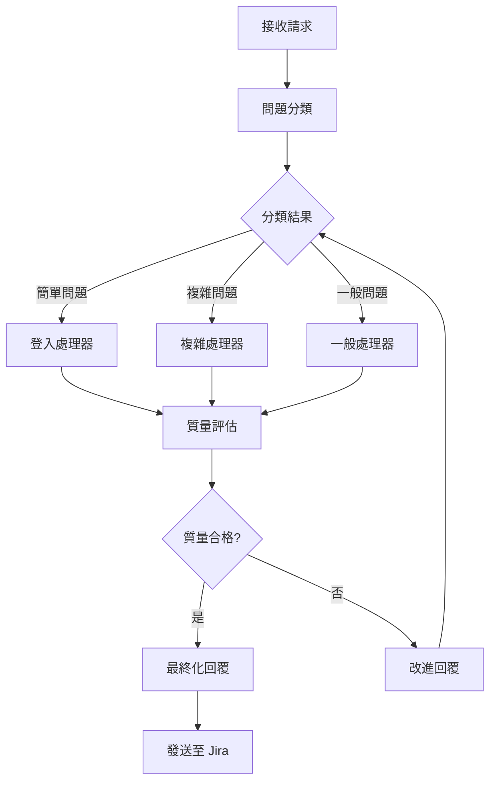

# JiraCSServer v2.0

> Next.js + TypeScript 驅動的 Jira 客服智能工作流系統

[](https://www.typescriptlang.org/)
[](https://nextjs.org/)
[](https://pnpm.io/)
[](https://github.com/langchain-ai/langgraph)

## 📋 目錄

- [簡介](#簡介)
- [核心功能](#核心功能)
- [技術棧](#技術棧)
- [系統架構](#系統架構)
- [快速開始](#快速開始)
- [API 文檔](#api-文檔)
- [配置說明](#配置說明)
- [開發指南](#開發指南)
- [部署](#部署)
- [故障排除](#故障排除)

## 簡介

JiraCSServer v2.0 是一個基於 AI 的 Jira 客戶服務自動化系統，使用 Next.js 和 TypeScript 構建，採用 LangGraph 進行多代理工作流編排。

### v2.0 主要特性

- ✅ **Next.js 架構** - 現代化的全棧框架
- ✅ **Vite 構建** - 超快速的開發和生產構建
- ✅ **pnpm 管理** - 高效的依賴管理
- ✅ **多空間支持** - corp, confluence, ext, jira 專屬配置
- ✅ **智能分類** - AI 驅動的問題分類系統
- ✅ **後續處理** - 處理用戶追問和對話上下文
- ✅ **批量處理** - 並行或順序處理多個工單
- ✅ **質量評估** - 自動評估回覆質量並優化

## 核心功能

### 1. 多空間問題類型系統

根據不同的空間（corp, confluence, ext, jira）提供專屬的請求類型：

```typescript
// Jira 專屬
- 欄位設置 (Field Setup)
- 工作流程 (Workflow)

// Confluence/Ext 專屬
- 新賬號授權 (New Account)

// 所有空間通用
- 登入問題 (Login)
- 權限管理 (Permission)
- 新空間申請 (New Space)
- 咨詢 (Consultation)
- 許願池 (Wish Pool)
- 其他 (Other)
```

### 2. 智能工作流



### 3. API 端點

#### 核心端點

| 端點 | 方法 | 描述 |
|------|------|------|
| `/api/jira/process` | POST | 處理單一工單 |
| `/api/jira/batch` | POST | 批量處理工單 |
| `/api/jira/postProcess` | POST | 處理追問 ⭐新 |
| `/api/jira/health` | GET | 健康檢查 |
| `/api/jira/info` | GET | 系統信息 |
| `/api/jira/status/:workflowId` | GET | 工作流狀態 |

## 技術棧

### 前端/框架
- **Next.js 15** - React 框架
- **TypeScript 5.9** - 類型安全
- **React 18** - UI 庫

### 後端/AI
- **LangGraph 0.4** - 工作流編排
- **LangChain Core** - AI 鏈工具
- **OpenAI API** - LLM 服務

### 構建/工具
- **Vite 6** - 構建工具
- **pnpm 10** - 套件管理器
- **Express 5** - HTTP 服務器（可選）

### 基礎設施
- **Helmet** - 安全中間件
- **CORS** - 跨域支持
- **Morgan** - 請求日誌
- **Joi** - 數據驗證

## 系統架構

```
JiraCSServer/
├── app/                      # Next.js App Router
│   └── api/
│       └── jira/
│           ├── process/      # 單一處理端點
│           ├── batch/        # 批量處理端點
│           ├── postProcess/  # 追問處理端點 ⭐新
│           ├── health/       # 健康檢查
│           └── info/         # 系統信息
├── src/
│   ├── agents/              # AI 代理
│   │   ├── classifier.ts          # 問題分類器
│   │   ├── login-handler.ts       # 登入處理器
│   │   ├── complex-handler.ts     # 複雜問題處理器
│   │   ├── general-handler.ts     # 一般問題處理器
│   │   ├── quality-evaluator.ts   # 質量評估器
│   │   └── post-process-handler.ts # 追問處理器 ⭐新
│   ├── workflow/            # 工作流編排
│   │   ├── orchestrator.ts        # 主編排器
│   │   └── state.ts              # 狀態管理
│   ├── types/               # TypeScript 類型
│   │   ├── index.ts              # 核心類型
│   │   └── extended.ts           # 擴展類型 ⭐新
│   ├── clients/             # 外部客戶端
│   │   └── jira-client.ts        # Jira API 客戶端
│   ├── middleware/          # 中間件
│   │   ├── errorHandler.ts       # 錯誤處理
│   │   └── validation.ts         # 數據驗證
│   ├── utils/               # 工具函數
│   │   └── config.ts             # 配置管理
│   └── server.ts            # Express 服務器（可選）
├── vite.config.ts           # Vite 配置 ⭐新
├── next.config.mjs          # Next.js 配置 ⭐新
├── tsconfig.json            # TypeScript 配置
├── package.json             # 依賴配置
└── pnpm-workspace.yaml      # pnpm 工作區 ⭐新
```

## 快速開始

### 前置要求

- Node.js >= 18.0.0
- pnpm >= 9.0.0
- OpenAI API Key
- Jira 實例訪問權限

### 安裝

```bash
# 克隆倉庫
git clone https://github.com/your-org/JiraCSServer.git
cd JiraCSServer

# 安裝依賴
pnpm install

# 配置環境變數
cp .env.example .env
nano .env
```

### 環境變數配置

編輯 `.env` 文件：

```env
# OpenAI Configuration
OPENAI_API_KEY=sk-your-api-key
OPENAI_MODEL=gpt-4o
OPENAI_BASE_URL=https://api.openai.com/v1

# Jira Configuration
JIRA_BASE_URL=https://your-jira-instance.com
JIRA_AUTH_TOKEN=your_base64_auth_token

# Application
NODE_ENV=development
PORT=3000
LOG_LEVEL=info

# CORS
CORS_ORIGINS=http://localhost:3000

# Testing
TEST_MODE=false
```

### 開發模式

```bash
# 啟動 Next.js 開發服務器
pnpm dev

# 或使用 Express 服務器
pnpm run server:dev
```

訪問：
- Next.js: http://localhost:3000
- API: http://localhost:3000/api/jira

### 生產構建

```bash
# Next.js 構建
pnpm build
pnpm start:prod

# 或 Vite 構建
pnpm run build:vite
pnpm run server:prod
```

## API 文檔

### POST /api/jira/process

處理單一 Jira 工單。

**請求：**

```json
{
  "forms": {
    "Project ID": "JCSC-123",
    "Issue Type": "Support Request",
    "Reporter": "john.doe",
    "Created": "2025/10/13 10:00",
    "Updated": "2025/10/13 10:00",
    "Summary": "無法登入系統",
    "Space Type": "jira",
    "Request Type": "login",
    "Is Batch Request": false,
    "Anonymous Submission": false,
    "Comment": {
      "Created": "2025/10/13 10:00",
      "Updated": "2025/10/13 10:00",
      "Content": "我嘗試用公司帳號登入，但一直顯示錯誤..."
    }
  }
}
```

**回應：**

```json
{
  "success": true,
  "data": {
    "issue_key": "JCSC-123",
    "Source": "我嘗試用公司帳號登入，但一直...",
    "comment_content": "您好！關於您的登入問題...",
    "workflow_id": "abc-123-def-456",
    "processing_time": 2345,
    "classification": {
      "category": "JIRA_SIMPLE",
      "confidence": 0.95
    },
    "quality_score": 92
  }
}
```

### POST /api/jira/postProcess ⭐新

處理用戶追問。

**請求：**

```json
{
  "original_issue_key": "JCSC-123",
  "workflow_id": "abc-123-def-456",
  "follow_up_content": "我還是不太明白重置密碼的步驟",
  "user": "john.doe",
  "timestamp": "2025-10-13T10:30:00Z",
  "context": {
    "previous_response": "先前的回覆內容...",
    "conversation_history": [
      {
        "role": "user",
        "content": "初始問題",
        "timestamp": "2025-10-13T10:00:00Z"
      },
      {
        "role": "agent",
        "content": "初始回覆",
        "timestamp": "2025-10-13T10:15:00Z"
      }
    ]
  }
}
```

**回應：**

```json
{
  "success": true,
  "data": {
    "original_issue_key": "JCSC-123",
    "workflow_id": "abc-123-def-456",
    "response": "當然！讓我更詳細地說明密碼重置步驟...",
    "confidence": 0.89,
    "suggested_action": "provide_answer",
    "processing_time": 1234
  }
}
```

### POST /api/jira/batch

批量處理多個工單。

**請求：**

```json
{
  "issues": [
    { /* issue 1 */ },
    { /* issue 2 */ }
  ],
  "options": {
    "parallel": true,
    "max_concurrent": 5,
    "stop_on_error": false,
    "group_by_space": false,
    "priority_order": "fifo"
  }
}
```

## 配置說明

### 請求類型配置

不同空間支持不同的請求類型：

```typescript
import { SPACE_REQUEST_TYPE_MAP, RequestType } from '@/types/extended';

// 檢查 Jira 是否支持欄位設置
const supportsFieldSetup = SPACE_REQUEST_TYPE_MAP['jira']
  .includes(RequestType.FIELD_SETUP); // true

// Confluence 不支持欄位設置
const confSupports = SPACE_REQUEST_TYPE_MAP['confluence']
  .includes(RequestType.FIELD_SETUP); // false
```

### 欄位驗證規則

```typescript
import { REQUEST_TYPE_FIELD_CONFIG } from '@/types/extended';

const config = REQUEST_TYPE_FIELD_CONFIG[RequestType.NEW_ACCOUNT];

console.log(config.required_fields);
// ['Reporter', 'Space Type', 'User Signature']

console.log(config.validation_rules);
// { space_type: ['confluence', 'ext'] }
```

## 開發指南

### 添加新的請求類型

1. 在 `src/types/extended.ts` 中添加類型：

```typescript
export enum RequestType {
  // ... existing types
  NEW_TYPE = 'new_type',
}
```

2. 配置空間映射：

```typescript
export const SPACE_REQUEST_TYPE_MAP: Record<SpaceType, RequestType[]> = {
  jira: [
    // ... existing types
    RequestType.NEW_TYPE,
  ],
};
```

3. 配置欄位規則：

```typescript
export const REQUEST_TYPE_FIELD_CONFIG: Record<RequestType, RequestTypeFieldConfig> = {
  [RequestType.NEW_TYPE]: {
    required_fields: ['field1', 'field2'],
    optional_fields: ['field3'],
    validation_rules: {},
    handler_type: 'complex',
  },
};
```

### 添加新的 Agent

1. 創建 agent 文件：

```typescript
// src/agents/new-handler.ts
export class NewHandlerAgent {
  async handle(state: WorkflowState): Promise<Partial<WorkflowState>> {
    // Your logic here
  }
}
```

2. 在編排器中註冊：

```typescript
// src/workflow/orchestrator.ts
private newHandler: NewHandlerAgent;

constructor() {
  this.newHandler = new NewHandlerAgent();
  // ...
}
```

### 測試

```bash
# 運行測試
pnpm test

# 模擬模式測試
pnpm run test:mock

# API 測試
pnpm run test:api
```

## 部署

### Docker 部署

```dockerfile
FROM node:18-alpine

WORKDIR /app

# 安裝 pnpm
RUN npm install -g pnpm

# 複製文件
COPY package.json pnpm-lock.yaml ./
RUN pnpm install --frozen-lockfile

COPY . .

# 構建
RUN pnpm build

EXPOSE 3000

CMD ["pnpm", "start:prod"]
```

### 環境變數（生產）

```env
NODE_ENV=production
OPENAI_API_KEY=your_production_key
JIRA_BASE_URL=https://jira.company.com
PORT=3000
LOG_LEVEL=error
```

## 故障排除

### 常見問題

#### 1. pnpm install 失敗

```bash
# 清除緩存
pnpm store prune
pnpm install
```

#### 2. TypeScript 類型錯誤

```bash
# 檢查類型
pnpm run type-check

# 重建
rm -rf .next dist
pnpm build
```

#### 3. API 連接錯誤

檢查環境變數：
- `OPENAI_API_KEY` 是否正確
- `JIRA_BASE_URL` 是否可訪問
- `JIRA_AUTH_TOKEN` 是否有效

#### 4. 模組解析錯誤

```bash
# 重啟 TypeScript 服務器
# 或清除 .next 緩存
rm -rf .next
pnpm dev
```

## 性能優化

### 建議配置

- **批量處理**: 使用 `parallel: true` 和適當的 `max_concurrent`
- **緩存**: 啟用 API 響應緩存
- **超時**: 設置合理的超時時間
- **日誌**: 生產環境使用 `LOG_LEVEL=error`

## 許可證

ISC

## 貢獻

歡迎貢獻！請遵循以下步驟：

1. Fork 本倉庫
2. 創建功能分支 (`git checkout -b feature/amazing-feature`)
3. 提交更改 (`git commit -m 'Add amazing feature'`)
4. 推送到分支 (`git push origin feature/amazing-feature`)
5. 開啟 Pull Request

## 相關文檔

- [API 文檔](./API.md)
- [部署指南](./DEPLOYMENT.md)
- [遷移指南](./MIGRATION_GUIDE.md)

## 聯繫方式

- Issues: [GitHub Issues](https://github.com/your-org/JiraCSServer/issues)
- Email: support@your-company.com

---

**版本:** 2.0.0
**最後更新:** 2025-10-13
