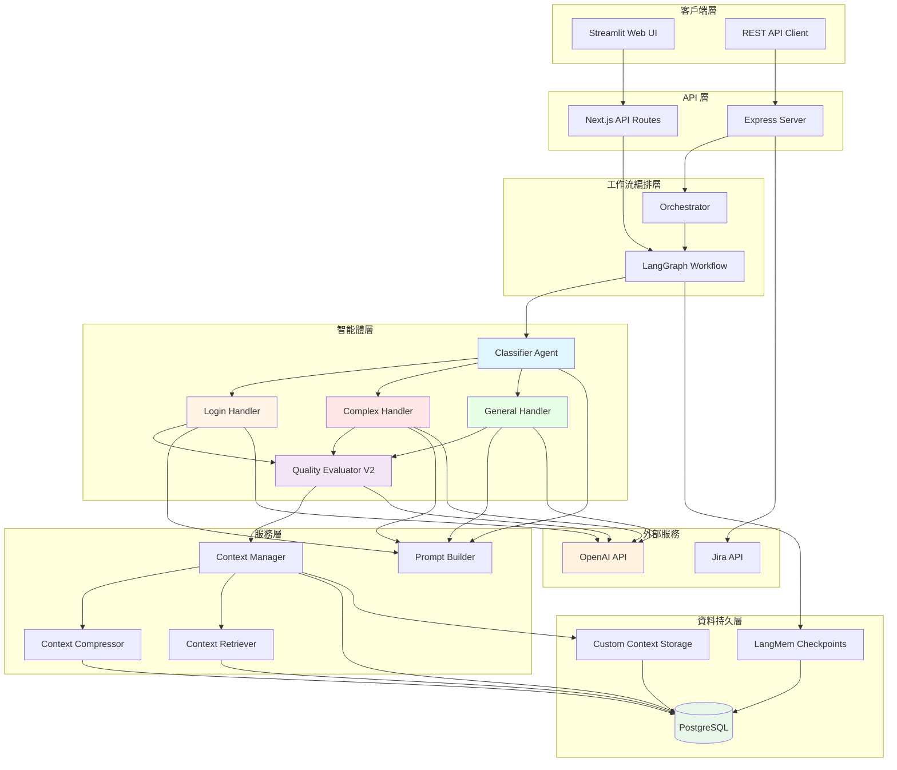
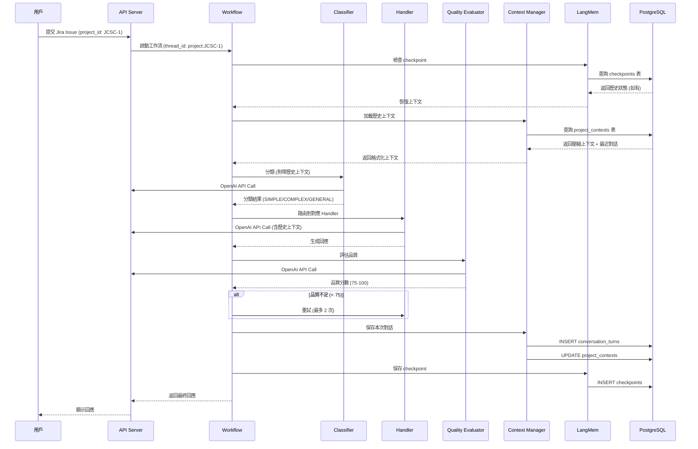
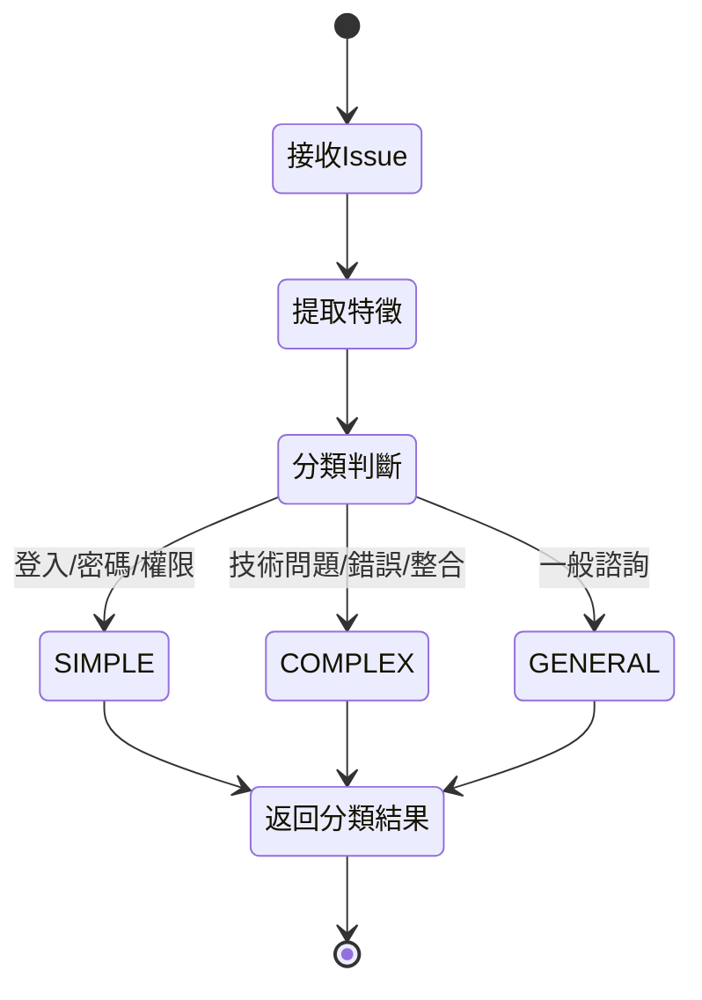
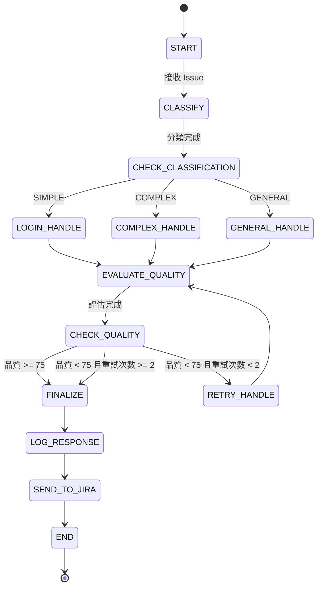
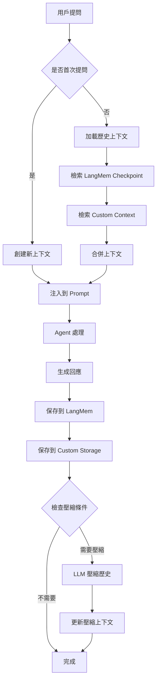
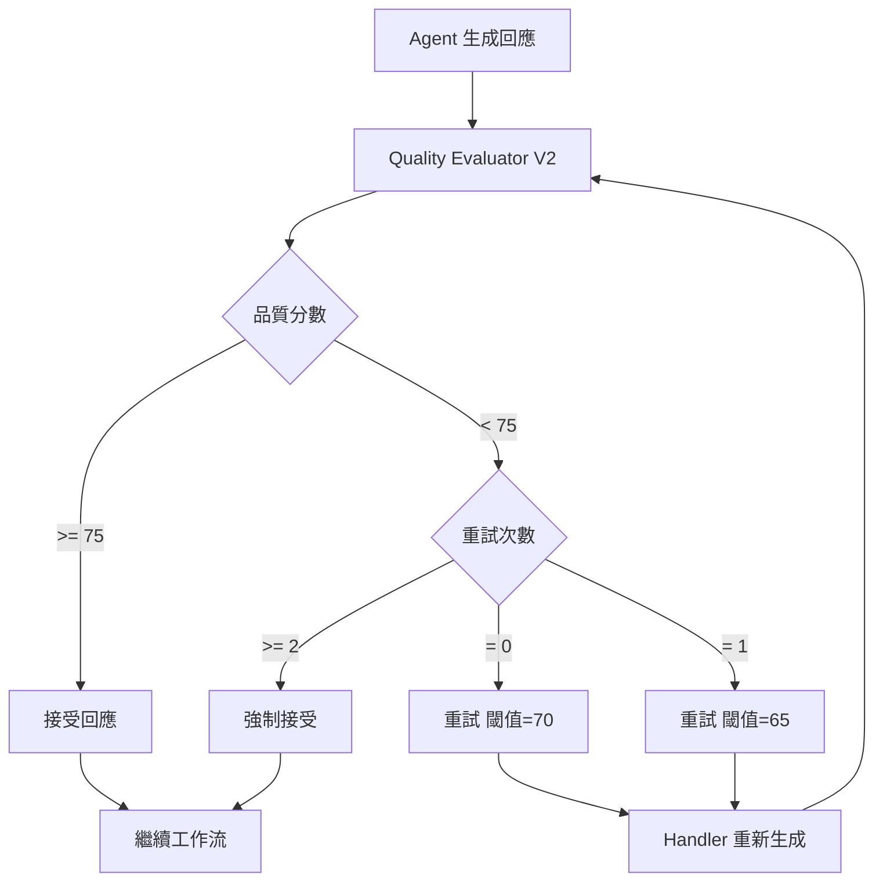

# JiraCSServer - 產品需求規劃書

**專案名稱**: JiraCSServer
**版本號**: v1.0 MVP
**文檔版本號**: 1.0
**日期**: 2025-10-27
**狀態**: MVP 技術驗證階段
**作者**: ALVIS.MC.TSAO

---

## 目錄

1. [專案概述](#1-專案概述)
2. [系統定位與目標用戶](#2-系統定位與目標用戶)
3. [技術架構](#3-技術架構)
4. [功能需求](#4-功能需求)
5. [非功能需求](#5-非功能需求)
6. [MVP 範圍](#6-mvp-範圍)
7. [風險與限制](#7-風險與限制)
8. [附錄](#8-附錄)

---

## 1. 專案概述

### 1.1 背景與問題

當前 Jira 客戶服務場景面臨挑戰:

1. **回應時間長**: 即使是簡單問題也通常需要 10 分鐘以上
2. **分類不準確**: 人工判斷易有偏差或疏漏
3. **上下文丟失**: 後續追問時需重新理解問題
4. **缺乏品質控管**: 回應品質依賴人員經驗
5. **擴展性低**: 業務拓展後客服人員難以及時跟上最新的變化

### 1.2 解決方案

JiraCSServer 是一個 AI 驅動的 Jira 智能客服系統,基於 Next.js 15 + TypeScript 5.7 + LangGraph 構建,提供:

- AI 自動分類與問題複雜度評估
- 多智能體協同工作流
- 自動化上下文持久化 (LangMem)
- 智能品質評估與自動重試機制
- Jira (REST API)與 Web UI 雙介面

### 1.3 MVP 目標

**本階段為技術驗證 MVP,主要目標**:

1. 驗證 LangGraph 工作流可行性
2. 驗證多智能體協同效果
3. 驗證 LangMem 自動記憶體管理
4. 評估 OpenAI API 成本
5. 評估系統響應速度與準確率
6. 為後續產品化提供技術基礎

**成功指標**:
- 分類準確率 > 85%
- 平均響應時間 < 5 秒
- 品質評估準確識別低品質回應 (< 75 分)
- 上下文持久化與恢復成功率 > 95%

---
  

## 2. 系統定位與目標用戶

### 2.1 業務背景

目前公司的 Jira 業務主要爲:

- **專案管理系統**: Jira 作為核心專案管理平台

- **專案生命周期管理**: 從需求到交付的完整生命周期追蹤

- **系統整合**: 與 ERP、PLM、MES 等企業內部系統整合

- **工業軟體互通**: 與 CAD/CAM、測試設備、生產管理軟體的數據交互


**當前痛點**:

- IT 支援團隊每天處理 10-30 個 Jira 相關工單

- 60% 為重複性問題 (登入、權限、欄位設置)

- 平均響應時間 30 分鐘,影響生產效率

- 跨系統整合問題需要多輪溝通,耗時 2-3 小時, 並且不具有彼此業務的Know-how, 效率低下。

- 夜班與週末無 IT 支援,問題堆積


### 2.2 使用場景與 User Stories

  

#### 場景 1: 製造現場工程師登入問題

  

**背景**: 現場工程師需要快速登入 Jira 記錄生產異常,但忘記密碼

  

**User Story**:

```

作為製造現場工程師

我想要快速重設 Jira 密碼

以便立即記錄生產線發現的品質問題

避免因登入問題延誤異常上報

```

  

**驗收標準**:

- 通過 Chatbot 提交密碼重設請求

- 2 秒內收到重設步驟指引

- 包含自助重設連結與 IT 支援聯絡方式

- 系統自動記錄為 SIMPLE 類型

- 無需人工介入,自動結案

  

**系統行為**:

1. 用戶輸入: "忘記 Jira 密碼,無法登入"

2. **Classifier** 自動分類為 SIMPLE - 登入問題

3. **Login Handler** 生成回應:

   - 步驟 1: 訪問公司 SSO 重設頁面 (附連結)

   - 步驟 2: 使用 AD 賬號驗證

   - 步驟 3: 設置新密碼 (需符合密碼政策)

   - 備註: 如仍無法登入,請聯絡 IT 分機 8888

4. **Quality Evaluator** 評估回應完整性 (分數 > 75)

5. 系統自動創建 Jira Issue (類型: Service Request)

6. 狀態更新為 "已結案"

  

**實際效益**:

- 響應時間: 30 分鐘 → 3 分鐘（約爲3論對話->描述、補充、確認）

- IT 工單量減少 30%

- 現場工程師滿意度提升

 
#### 場景 2: 專案經理處理 Jira 與 ERP 整合錯誤

  

**背景**: 專案經理發現 Jira Issue 無法同步到 ERP 系統,影響成本核算

  

**User Story**:

```

作為專案經理

我想要解決 Jira 與 ERP 的數據同步問題

以便準確追蹤專案成本與資源分配

避免月底對賬時發現數據不一致

```

  

**驗收標準**:

- 描述錯誤現象與影響範圍

- 提供 Jira Issue Key 與 ERP 單號

- 附帶錯誤日誌或截圖 (如有)

- 系統分析錯誤原因並提供排查步驟

- 複雜問題自動升級到人工審核

  

**系統行為**:

1. 用戶輸入:

   ```

   專案: PROJ-2024-001

   問題: Jira Issue PROJ-123 無法同步到 ERP

   錯誤訊息: "API timeout after 30s"

   影響: 本月成本核算延遲

   ```

  

2. **Classifier** 分類為 COMPLEX - 系統整合問題

3. **Complex Handler** 分析:

   - 檢索知識庫中 "Jira-ERP 整合" 相關文檔

   - 識別關鍵詞: "API timeout", "ERP"

   - 加載歷史類似問題與解決方案

  

4. **Complex Handler** 生成多步驟排查方案:

   ```

   ### 可能原因分析

   5. ERP API 服務異常或維護中

   6. Jira 與 ERP 間的網路連線問題

   7. 資料欄位映射錯誤

   8. ERP 權限不足

  

   ### 排查步驟

   步驟 1: 檢查 ERP 系統狀態

   - 訪問 ERP 健康檢查頁面: http://erp.company.com/health

   - 確認 API 服務是否正常

  

   步驟 2: 驗證網路連線

   - 檢查 Jira 伺服器是否可訪問 ERP API

   - 聯絡網路管理員確認防火牆規則

  

   步驟 3: 檢查資料映射

   - 確認 Jira Issue 的必填欄位是否完整

   - 驗證 ERP 成本中心代碼是否正確

  

   步驟 4: 查看詳細日誌

   - 訪問 Jira Admin > System > Integrations > ERP Logs

   - 查找 PROJ-123 的同步錯誤詳情

  

   ### 暫時解決方案

   - 手動在 ERP 創建對應單據

   - 記錄 Issue Key 以便後續補同步

  

   ### 升級條件

   如排查後仍無法解決,請提供:

   - Jira 與 ERP 完整錯誤日誌

   - 網路連線測試結果

   - 問題將自動升級至 IT 整合團隊

   ```

  

5. **Quality Evaluator** 評估:

   - 技術深度: ✅ (涵蓋多個可能原因)

   - 可操作性: ✅ (提供明確步驟)

   - 完整性: ✅ (包含暫時解決方案與升級路徑)

   - 分數: 82 (通過)

  

6. 系統創建 Jira Issue (類型: Technical Issue)

7. 狀態更新為 "待處理" (等待用戶排查反饋)

  

**後續處理**:

- 用戶回報: "步驟 1 發現 ERP 正在維護"

- 系統更新狀態為 "已結案 - ERP 維護"

- 自動關聯到 "ERP 維護通知" (如有)

  

**實際效益**:

- 排查時間: 2-3 小時 → 15 分鐘

- 提供結構化排查流程,降低遺漏

- 自動關聯歷史案例,提升解決效率

  

---

  

#### 場景 3: IT 支援處理批量權限申請

  

**背景**: 新專案啟動,需為 20 名團隊成員開通 Jira 與 Confluence 權限

  

**User Story**:

```

作為專案經理

我想要批量申請團隊成員的 Jira 權限

以便專案快速啟動

避免逐一提交工單浪費時間

```

  

**驗收標準**:

- 支持批量提交 (Excel 或表單)

- 自動驗證 AD 賬號存在性

- 區分不同權限等級 (檢視者/編輯者/管理員)

- 一次性創建所有 Jira Issue

- 自動分配給對應系統管理員

  

**系統行為**:

1. 用戶通過 Chatbot 選擇 "批量權限申請"

2. 上傳 Excel 或填寫表單:

   ```

   專案: PROJ-2024-002

   系統: Jira + Confluence

   成員清單:

   - user001@company.com | 編輯者 | Jira

   - user002@company.com | 檢視者 | Jira + Confluence

   - ... (共 20 人)

   ```

  

3. **系統驗證**:

   - 檢查 AD 賬號是否存在

   - 驗證專案是否已創建

   - 檢查申請人是否有權限 (需為專案經理或以上)

  

4. **Batch Processor** 處理:

   - 創建 20 個 Jira Issue (類型: Access Request)

   - 自動分配給 Jira 管理員 (user.admin@company.com)

   - 添加 Watcher: 申請人

   - 設置 Due Date: 1 個工作日內

  

5. **通知機制**:

   - Email 通知管理員: "您有 20 個待處理的權限申請"

   - Email 通知申請人: "批量申請已提交,預計 1 日內完成"

  

6. 管理員處理後,系統自動更新所有 Issue 狀態

  

**實際效益**:

- 提交時間: 20 個單獨工單 (40 分鐘) → 1 個批量申請 (5 分鐘)

- 減少 IT 支援團隊重複操作

- 提升專案啟動效率

  

---

  

#### 場景 4: 多輪對話解決工作流配置問題

  

**背景**: 專案團隊需要自定義 Jira 工作流,但不熟悉配置步驟

  

**User Story**:

```

作為專案管理員

我想要通過對話方式學習如何配置 Jira 工作流

以便根據團隊需求自定義流程

避免每次都需要聯絡 IT 支援

```

  

**驗收標準**:

- 支持多輪對話澄清需求

- 提供分步指引與截圖

- 自動保存對話歷史

- 後續追問時理解上下文

- 對話結束後生成配置文檔

  

**系統行為 (多輪對話)**:

  

**第 1 輪 - 需求澄清**:

- 用戶: "如何為專案 PROJ-123 配置自定義工作流?"

- Classifier: COMPLEX - 工作流配置

- Complex Handler:

  ```

  為了提供精準的配置指引,請告訴我:

  1. 您的專案類型? (軟體開發/硬體設計/製造管理)

  2. 需要幾個工作流狀態? (例: 待辦/進行中/測試/完成)

  3. 是否需要審批流程?

  4. 是否需要自動化規則? (例: 狀態變更時自動通知)

  ```

- thread_id: `project:PROJ-123` (保存到 LangMem)

  

**第 2 輪 - 詳細回應**:

- 用戶:

  ```

  1. 硬體設計專案

  2. 需要 5 個狀態: 需求分析/設計/打樣/測試/量產

  3. 需要設計審批與測試簽核

  4. 需要自動通知相關人員

  ```

- 系統加載 thread_id: `project:PROJ-123` 的歷史上下文

- Complex Handler 生成詳細配置步驟 (篇幅較長,包含截圖位置說明)

  

**第 3 輪 - 追問細節**:

- 用戶: "測試簽核需要兩個人都同意才能進入量產,如何設置?"

- 系統理解上下文 (硬體設計工作流 + 測試簽核)

- Complex Handler:

  ```

  多人審批設置步驟:

  1. 進入工作流編輯器

  2. 選擇 "測試 → 量產" 轉換

  3. 添加條件: Approvers (選擇 2 個審批者)

  4. 設置規則: "需要所有審批者同意"

  5. 配置自動通知: 審批完成後通知專案經理

  ```

  

**第 4 輪 - 驗證與結案**:

- 用戶: "已完成配置,運作正常,謝謝!"

- 系統判斷對話結束

- 自動生成配置摘要文檔 (PDF)

- 保存到 Confluence 知識庫

- 狀態更新為 "已結案"

  

**上下文管理**:

- 所有 4 輪對話保存到 `conversation_turns` 表

- 關鍵信息壓縮為摘要:

  ```

  專案: PROJ-123 (硬體設計)

  需求: 5 狀態工作流 + 多人審批

  解決方案: 自定義工作流 + 審批規則

  狀態: 已完成配置

  ```

- 壓縮後的上下文供未來類似問題參考

  

**實際效益**:

- 自助配置,減少 IT 依賴

- 結構化對話,避免信息遺漏

- 自動生成文檔,方便團隊參考

---

## 3. 技術架構

### 3.1 系統架構圖



### 3.2 資料流程



### 3.3 核心組件

#### 3.3.1 LangGraph Workflow
- **職責**: 定義智能體協同流程
- **特性**: 狀態機式工作流,支持條件路由與重試
- **檔案**: `src/workflow/graph.ts`

#### 3.3.2 智能體 (Agents)
- **Classifier**: 問題分類與複雜度評估
- **Login Handler**: 登入問題標準化處理
- **Complex Handler**: 複雜技術問題深度分析
- **General Handler**: 一般性問題回應
- **Quality Evaluator V2**: 自適應閾值品質評估

#### 3.3.3 LangMem (記憶體管理)
- **PostgresSaver**: LangGraph 原生 checkpoint 機制
- **thread_id**: 使用 `project:{ProjectID}` 標識對話
- **自動化**: 無需手動管理狀態保存與恢復

#### 3.3.4 Context Storage (補充分析)
- **Custom Tables**: project_contexts, conversation_turns, compression_history
- **用途**: 長期分析,壓縮策略優化,審計追蹤
- **與 LangMem 區別**: LangMem 負責工作流狀態,Context Storage 負責業務分析

---

## 4. 功能需求

### 4.1 核心功能模組

#### 模組 1: 智能分類系統

**User Story 1: 自動分類工單**

作為系統
我想要自動識別問題類型和複雜度
以便將工單路由到正確的處理流程

**驗收標準**:
- 分類準確率 > 85%
- 支持 3 種分類: SIMPLE/COMPLEX/GENERAL
- 包含信心度評分 (confidence)
- 響應時間 < 2 秒

**分類流程**:



**技術實現**:
- 使用 OpenAI GPT-4o 進行分類
- Prompt 包含分類規則與範例
- 返回 JSON 格式結果 (classification, confidence, reasoning)

---

#### 模組 2: 多智能體工作流

**User Story 2: 動態路由處理**

作為系統
我想要根據分類結果動態選擇適當的 Handler
以便提供專業化的回應

**驗收標準**:
- 根據分類自動路由到對應 Handler
- 支持 Login/Complex/General 三種 Handler
- Handler 切換無延遲
- 保持狀態一致性

**工作流狀態機**:



**技術實現**:
- LangGraph 條件邊 (conditional edges)
- 狀態共享通過 WorkflowState
- 支持重試機制 (最多 2 次)

---

#### 模組 3: 上下文管理系統

**User Story 3: 自動持久化對話歷史**

作為系統
我想要自動保存每次對話的完整上下文
以便用戶追問時能理解前因後果

**驗收標準**:
- 每次對話自動存儲到 PostgreSQL
- 使用 Project ID 作為索引鍵
- 支持跨會話恢復 (thread_id 一致)
- 上下文恢復成功率 > 95%

**User Story 4: 智能壓縮長對話**

作為系統
我想要在對話過長時自動壓縮歷史
以便在保留關鍵信息的同時降低 token 成本

**驗收標準**:
- 觸發條件: 對話輪數 > 5 或 總 tokens > 10000
- 保留最近 3 輪完整對話
- 壓縮率 > 60%
- 壓縮後仍保留關鍵信息 (摘要/未解決問題/重要決策)

**上下文管理流程**:



**技術實現**:
- **LangMem**: PostgresSaver 自動管理 checkpoint (工作流狀態)
- **Custom Storage**: project_contexts/conversation_turns 表 (業務分析)
- **壓縮**: 使用 GPT-4o-mini,提取摘要/關鍵點/未解決問題/決策
- **thread_id 格式**: `project:{ProjectID}` (如 `project:JCSC-1`)

---

#### 模組 4: 品質評估與重試

**User Story 5: 自動評估回應品質**

作為系統
我想要自動評估 Agent 回應的品質
以便確保低品質回應被重新生成

**驗收標準**:
- 對每個回應進行品質評分 (0-100)
- 評估維度: 完整性/準確性/專業性/可操作性
- 分數 < 75 自動觸發重試
- 最多重試 2 次

**User Story 6: 自適應重試閾值**

作為系統
我想要在重試時逐步降低品質閾值
以便在保證品質的同時避免無限重試

**驗收標準**:
- 首次閾值 75 分
- 第 1 次重試閾值 70 分
- 第 2 次重試閾值 65 分
- 超過 2 次重試後強制接受

**品質評估流程**:



**技術實現**:
- Quality Evaluator V2 使用 GPT-OSS-20b （或 Mistral-small）
- 返回結構化評估 (分數/反饋/改進建議)
- 閾值動態調整: `Math.max(75 - retries * 5, 65)`

---

#### 模組 5: Prompt 工程系統

**User Story 7: 動態組裝 Prompt**

作為系統
我想要根據不同場景動態組裝 Prompt
以便提供精準的上下文與指令

**驗收標準**:
- 支持分層 Prompt 構建 (基礎層/知識層/上下文層)
- 自動注入歷史上下文
- 支持知識庫擴展 (Jira 操作指南/技術文檔)
- Prompt Token 數可控 (< 8000 tokens)

**技術實現**:
- PromptBuilder 統一入口
- ContextAssembler 組裝各類上下文
- 知識庫模組化: JiraKnowledgeBase/TechnicalProcedures/TroubleshootingGuides
- 使用 tiktoken 計算 token 數

---

#### 模組 6: REST API 與客戶端

**User Story 8: 提供 REST API 介面**

作為開發者
我想要通過 REST API 提交 Issue 並獲得回應
以便將系統整合到現有流程

**驗收標準**:
- POST /api/workflow - 提交 Issue 並執行工作流
- GET /api/health - 健康檢查
- 支持 JSON 格式請求/響應
- API 響應時間 < 10 秒

**User Story 9: 提供 Streamlit Web UI**

作為測試人員
我想要通過 Web UI 快速測試系統
以便驗證功能與觀察日誌

**驗收標準**:
- 支持輸入 Jira Issue 資訊 (Project ID/Summary/Description)
- 即時顯示工作流執行狀態
- 顯示分類/回應/品質評分
- 支持多輪對話測試 (相同 Project ID)

**技術實現**:
- **API Server**: Express + Next.js API Routes
- **Streamlit Client**: Python + Streamlit + requests
- **通信**: HTTP REST API (JSON)

---

### 4.2 功能需求清單

#### 4.2.1 Issue Type 設計

| 功能項目 | 狀態 | 說明 | 優先級 |
|---------|------|------|--------|
| 根據空間區分 type | ✅ 已實現 | 支持 corp, confluence, ext, jira 四種空間類型 | P0 |
| 不同需求流程支持 | ✅ 已實現 | 每種空間類型有獨立的工作流程 | P0 |
| 動態 Issue Type 映射 | 🔄 規劃中 | 根據用戶選擇的系統自動映射對應的 Issue Type | P1 |

#### 4.2.2 欄位設置

| 欄位名稱 | 適用空間 | 狀態 | 說明 | 優先級 |
|---------|---------|------|------|--------|
| 需求類型 (9 種) | 全部 | ✅ 已實現 | 登入、權限、咨詢、欄位設置、工作流程、新空間申請、許願池、新賬號授權、批量需求 | P0 |
| 新賬號授權 | conf, ext | ✅ 已實現 | Confluence 和外部系統專屬欄位 | P0 |
| 登入問題 | 全部 | ✅ 已實現 | 通用類型 - 密碼重設、登入錯誤 | P0 |
| 權限問題 | 全部 | ✅ 已實現 | 通用類型 - 權限申請、權限變更 | P0 |
| 咨詢問題 | 全部 | ✅ 已實現 | 通用類型 - 一般咨詢 | P0 |
| 欄位設置 | jira | ✅ 已實現 | Jira 專屬 - 自定義欄位配置 | P1 |
| 工作流程 | jira | ✅ 已實現 | Jira 專屬 - 工作流配置 | P1 |
| 新空間申請 | 全部 | ✅ 已實現 | 申請新的 Jira/Confluence 空間 | P1 |
| 許願池 | 全部 | ✅ 已實現 | 功能建議與需求收集 | P2 |
| User 署名 | 全部 | ✅ 已實現 | 支持匿名提交 (Reporter 欄位) | P1 |
| 是否批量需求 | 全部 | ✅ 已實現 | 標記批量處理需求 | P1 |
| 環境 (Environment) | 全部 | 🔄 規劃中 | 生產/測試/開發環境標識 | P1 |
| 相關人員 (Watchers) | 全部 | 🔄 規劃中 | 需要關注此案件的人員清單 | P2 |
| 相關 Project/Issue | 全部 | 🔄 規劃中 | 關聯的專案或工單 | P2 |
| Due Date | 全部 | 🔄 規劃中 | 期望完成日期 | P2 |

#### 4.2.3 API Endpoints

| 端點 | 方法 | 狀態 | 說明 | 優先級 |
|------|------|------|------|--------|
| /api/jira/process | POST | ✅ 已實現 | 處理單一工單 | P0 |
| /api/jira/batch | POST | ✅ 已實現 | 批量工單處理 | P0 |
| /api/jira/postProcess | POST | ✅ 已實現 | 後續追問與補充信息 | P0 |
| /api/jira/health | GET | ✅ 已實現 | 系統健康檢查 | P0 |
| /api/jira/info | GET | ✅ 已實現 | 系統信息查詢 | P1 |
| /api/jira/status/:workflowId | GET | ✅ 已實現 | 查詢工作流執行狀態 | P1 |
| /api/jira/issues/:issueKey | GET | 🔄 規劃中 | 查詢特定工單詳情 | P1 |
| /api/jira/user/issues | GET | 🔄 規劃中 | 查詢用戶的所有工單 | P1 |
| /api/jira/analytics | GET | 🔄 規劃中 | 統計分析數據 | P2 |

#### 4.2.4 UI/UX 功能設計

##### A. Chatbot 欄位輸入畫面

| 功能項目 | 對應欄位 | 狀態 | 說明 | 優先級 |
|---------|---------|------|------|--------|
| 場景選擇 | issueType | ✅ 已實現 | Jira 還是相關外部系統 (corp/conf/ext/jira) | P0 |
| 環境選擇 | environment | 🔄 規劃中 | 生產/測試/開發環境 | P1 |
| 問題類型 | typeOfIssue | ✅ 已實現 | 9 種需求類型 | P0 |
| 指派人員 | assignee | 🔄 規劃中 | 自動分配或手動指定 | P1 |
| 相關人員 | watchers | 🔄 規劃中 | 需要關注的人員清單 | P2 |
| 相關 Project/Issue | linkedIssues | 🔄 規劃中 | 關聯的專案或工單 | P2 |
| 概要 | summary | ✅ 已實現 | 問題簡短描述 | P0 |
| Due Date | dueDate | 🔄 規劃中 | 期望完成日期 | P2 |
| 問題敘述 | description | ✅ 已實現 | 詳細問題描述 | P0 |
| 附件上傳 | attachments | ❌ 未規劃 | 支持截圖、日誌文件上傳 | P2 |
| 匿名提交 | anonymous | ✅ 已實現 | 是否匿名提交 | P1 |

##### B. 案件總覽功能

| 功能項目 | 狀態 | 說明 | 優先級 |
|---------|------|------|--------|
| AD 賬號整合 | 🔄 規劃中 | 通過 AD 賬號查詢用戶的所有案件 | P1 |
| 案件列表顯示 | 🔄 規劃中 | 顯示用戶提交的所有案件 | P1 |
| 案件狀態過濾 | 🔄 規劃中 | 討論中、處理中、已結案 | P1 |
| 案件詳情查看 | 🔄 規劃中 | 點擊案件查看完整對話歷史 | P1 |
| 案件搜索 | 🔄 規劃中 | 根據關鍵字、日期、狀態搜索 | P2 |
| 案件排序 | 🔄 規劃中 | 按創建時間、更新時間、優先級排序 | P2 |

##### C. 案件狀態管理

| 狀態 | 觸發條件 | 說明 | 優先級 |
|------|---------|------|--------|
| 討論中 | 🔄 規劃中 | 用戶與 AI 正在多輪對話 | P0 |
| 待處理 | 🔄 規劃中 | 討論結束,進入處理隊列 | P0 |
| 處理中 | ✅ 已實現 | 工作流正在執行 | P0 |
| 待審核 | 🔄 規劃中 | 複雜議題需人工審核 | P1 |
| 已結案 | 🔄 規劃中 | 問題已解決或關閉 | P0 |
| 重新開啟 | 🔄 規劃中 | 已結案案件的後續追問 | P1 |

##### D. 自動化處理邏輯

| 功能項目 | 狀態 | 說明 | 優先級 |
|---------|------|------|--------|
| 對話階段判斷 | 🔄 規劃中 | 判斷議題討論是否結束 (類似 CLI 工具) | P1 |
| 簡單議題自動處理 | ✅ 已實現 | Login Handler 自動處理登入問題 | P0 |
| 複雜議題人工審核 | 🔄 規劃中 | Complex Handler 處理後需人工確認 | P1 |
| 自動結案判斷 | 🔄 規劃中 | 根據用戶反饋自動結案 | P2 |

#### 4.2.5 系統整合功能

| 功能項目 | 狀態 | 說明 | 優先級 |
|---------|------|------|--------|
| Jira API 整合 | 🔄 規劃中 | 真實 Jira API 替代 Mock | P0 |
| AD 認證整合 | 🔄 規劃中 | Active Directory 用戶認證 | P1 |
| Confluence 整合 | ❌ 未規劃 | 與 Confluence 知識庫聯動 | P2 |
| Email 通知 | ❌ 未規劃 | 案件狀態變更通知 | P2 |
| Slack/Teams 整合 | ❌ 未規劃 | 即時通訊工具整合 | P3 |

#### 4.2.6 後台管理功能

| 功能項目 | 狀態 | 說明 | 優先級 |
|---------|------|------|--------|
| 管理員儀表板 | ❌ 未規劃 | 系統使用統計與監控 | P2 |
| Agent 配置管理 | ❌ 未規劃 | Prompt 模板管理 | P2 |
| 知識庫管理 | ❌ 未規劃 | 更新 Jira 操作指南等知識 | P2 |
| 用戶權限管理 | ❌ 未規劃 | 角色與權限配置 | P2 |
| 審計日誌 | 🔄 規劃中 | 記錄所有操作歷史 | P1 |

### 4.3 功能優先級總覽

| 功能模組 | 優先級 | MVP 狀態 | v2.1 計劃 | 說明 |
|---------|-------|---------|----------|------|
| 智能分類系統 | P0 | ✅ 已實現 | 優化準確率 | 核心功能 |
| 多智能體工作流 | P0 | ✅ 已實現 | 新增環境欄位 | 核心功能 |
| 上下文管理 (LangMem) | P0 | ✅ 已實現 | - | 核心功能 |
| 品質評估與重試 | P0 | ✅ 已實現 | - | 核心功能 |
| Prompt 工程系統 | P0 | ✅ 已實現 | 知識庫擴展 | 核心功能 |
| REST API | P0 | ✅ 已實現 | 新增查詢端點 | 必需介面 |
| Streamlit Web UI | P1 | ✅ 已實現 | 改為 Chatbot UI | 測試工具 → 生產工具 |
| 上下文壓縮 | P1 | ✅ 已實現 | - | 成本優化 |
| Custom Context Storage | P2 | ✅ 已實現 | - | 分析功能 |
| Issue Type 動態映射 | P1 | 🔄 規劃中 | v2.1 實現 | 靈活性增強 |
| Chatbot 欄位輸入 | P0 | 🔄 規劃中 | v2.1 實現 | 用戶介面 |
| 案件總覽 | P1 | 🔄 規劃中 | v2.1 實現 | 用戶體驗 |
| AD 認證整合 | P1 | 🔄 規劃中 | v2.1 實現 | 安全性 |
| Jira API 整合 | P0 | 🔄 規劃中 | v2.1 實現 | 生產必需 |
| 對話階段判斷 | P1 | 🔄 規劃中 | v2.1 實現 | 智能化 |
| 管理員儀表板 | P2 | ❌ 未規劃 | v2.5 | 運營工具 |

---

## 5. 非功能需求

### 5.1 性能需求

| 指標           | 目標值       | 測量方式         |
| ------------ | --------- | ------------ |
| 分類響應時間       | < 2 秒     | API 計時       |
| Handler 響應時間 | < 5 秒     | API 計時       |
| 端到端響應時間      | < 30 秒    | 用戶視角         |
| 上下文加載時間      | < 1000 ms | 資料庫查詢        |
| 並發處理能力       | 10 req/s  | 壓測 (MVP 不強制) |

### 5.2 可靠性需求

| 指標 | 目標值 | 說明 |
|-----|-------|------|
| 系統可用性 | > 99% | MVP 階段允許手動重啟 |
| 分類準確率 | > 85% | 人工評估 |
| 上下文恢復成功率 | > 95% | 自動化測試 |
| API 成功率 | > 95% | 排除 OpenAI API 故障 |

### 5.3 安全需求

- **API Key 管理**: 存儲於環境變數,不提交代碼庫
- **資料庫連接**: 使用 SSL (生產環境)
- **輸入驗證**: 對用戶輸入進行長度與格式檢查
- **錯誤處理**: 不暴露內部錯誤細節給用戶

### 5.4 可維護性需求

- **日誌記錄**: 完整記錄工作流執行過程 (WorkflowLogger)
- **TypeScript 嚴格模式**: 確保類型安全
- **單元測試**: 覆蓋核心邏輯 (MVP 可選)
- **文檔完整性**: 所有 API 與模組有文檔說明

### 5.5 開銷控制（待更新）

---

## 6. MVP 範圍

### 6.1 已實現功能

#### 核心工作流
- LangGraph 工作流定義與狀態管理
- Classifier → Handler → Quality Evaluator 完整流程
- 自適應重試機制 (最多 2 次)

#### 智能體
- Classifier Agent (V1/V2)
- Login/Complex/General Handler (V1/V2)
- Quality Evaluator V2 (自適應閾值)

#### 上下文管理
- LangMem 自動持久化 (PostgresSaver)
- Custom Context Storage (project_contexts/conversation_turns/compression_history)
- 智能壓縮 (LLM-driven,觸發條件: turns > 5 或 tokens > 10000)

#### Prompt 工程
- 分層 Prompt 構建系統
- 知識庫模組化 (Jira/技術/故障排除)
- 動態上下文注入

#### 介面
- Express REST API Server
- Next.js API Routes
- Streamlit Web UI 客戶端

#### 基礎設施
- PostgreSQL 資料庫 (Docker 部署)
- Drizzle ORM
- 環境變數配置管理

### 6.2 未實現功能 (未來規劃)

#### 短期 (v2.1) - 生產化準備

**核心目標**: 從技術驗證 MVP 轉向可生產使用的系統

##### UI/UX 升級
- **Chatbot 介面**
  - 替換現有 Streamlit 測試 UI
  - 實現欄位輸入畫面 (場景選擇、問題類型、環境等)
  - 支持多輪對話互動
  - 實時顯示處理進度

- **案件總覽頁面**
  - AD 賬號整合與用戶案件查詢
  - 案件列表與狀態過濾 (討論中、處理中、已結案)
  - 案件詳情查看與對話歷史
  - 基礎搜索與排序功能

##### 系統整合
- **進階 Jira API 整合**
  - Issue 自動創建與回覆
  - Jira 欄位動態映射
  - Webhook 接收 Jira 事件

- **AD 認證整合**
  - Active Directory 用戶驗證
  - 單點登入 (SSO) 支持
  - 用戶身份與案件關聯
##### 智能化增強

- **對話階段判斷**
  - 判斷議題討論是否完成
  - 自動觸發加入處理隊列
  - 支持 "討論中" → "待處理" 狀態轉換

- **複雜議題人工審核流程**
  - Complex Handler 處理後標記為 "待審核"
  - 通知人工審核員
  - 審核通過後自動結案或繼續處理

- **自主學習機制**
  - 從人工審核中學習
  - 自動優化分類準確率
  - 持續改進 Prompt
##### 其他功能
- 多語言支持 (繁體中文、英文)
- 環境欄位支持 (生產/測試/開發)
- 格式化日誌記錄
- 基礎性能監控
* 端到端響應時間 < 30 秒（確保不會慢於市面上多數 Chatbot 的響應速度）

---

#### 中、長期 (v2.5) - 企業級功能

**核心目標**: 增強系統可擴展性與管理能力
##### **批量統整和處理**
   * **對於以下兩種場景：**
    * 廠務
    * 大型專案的關聯工單
   * **能夠實現**
    * 理解關聯並整合
    * 提供交互方式便於進行批量處理
##### 管理後台
- **管理員儀表板**
  - 系統使用統計 (日活、案件量、響應時間)
  - Agent 性能監控 (分類準確率、品質評分分佈)

- **Agent 配置管理**
  - Prompt 模板編輯界面
  - 分類規則動態調整
  - A/B 測試支持

- **知識庫管理**
  - Jira 操作指南更新
  - 技術文檔維護
  - 常見問題庫 (FAQ)

##### 權限與多租戶
- **用戶角色管理**
  - 管理員、審核員、普通用戶
  - 細粒度權限控制

- **多租戶支持**
  - 多個 Jira Project 隔離
  - 租戶級配置與定制
  - 獨立的知識庫與 Prompt

##### 進階分析
- **報表系統**
  - 案件趨勢分析
  - 問題類型分佈
  - 用戶滿意度追蹤

- **智能推薦**
  - 相似問題推薦
  - 自動標籤與分類優化
  - 知識庫文章推薦

##### 系統整合擴展
- Confluence 知識庫整合
- Email 通知系統
- Slack/Teams 機器人

##### 企業級部署
- **Kubernetes 部署方案**
  - 容器化與編排
  - 自動擴展 (HPA)
  - 高可用架構 (HA)

- **多區域部署**
  - 跨區域負載均衡
  - 數據本地化支持
  - 災難恢復 (DR)

---

## 7. 風險與限制

### 7.1 技術風險

**高優先級**
#### 上下文 Token 限制
**描述**: 目前使用過的地端模型上下文窗口有限 (128k tokens),長對話可能超限
**影響**: 壓縮效果不佳或無法加載完整歷史
**緩解措施**:
- 智能壓縮機制 (已實現)
- 僅保留最近 N 輪完整對話
- 監控 token 使用量

#### Jira API 整合複雜性
**描述**: 真實 Jira API 可能與 Mock 行為不一致
**影響**: v2.1 整合時需大量調整
**緩解措施**:
- 提前研究 Jira REST API 文檔
- 使用 Jira 測試環境驗證
- 設計適配器模式隔離 Jira 邏輯

#### 風險 6: 對話階段判斷誤判
**描述**: AI 可能錯誤判斷對話是否結束
**影響**: 過早結案或長時間停留在討論中
**緩解措施**:
- 設計明確的結束信號 (用戶確認)
- 提供手動觸發處理的選項
- 記錄誤判案例並持續優化


**低優先級**
#### 資料庫性能瓶頸
**描述**: 高並發時 PostgreSQL 查詢可能變慢
**影響**: 上下文加載延遲
**緩解措施**:
- 優化索引 (project_id, created_at)
- 使用連接池 (已實現)
- 定期清理舊數據 (90 天前)

#### AD 認證整合安全性
**描述**: AD 整合可能暴露敏感信息或權限漏洞
**影響**: 用戶數據洩露或未授權訪問
**緩解措施**:
- 使用安全的認證協議 (OAuth 2.0, SAML)
- 實施最小權限原則
- 定期安全審計與滲透測試


### 7.2 業務風險

#### 分類準確率不足
**描述**: AI 分類可能出錯,導致路由錯誤
**影響**: 回應品質下降
**緩解措施**:
- 持續優化 Classifier Prompt
- 記錄錯誤分類案例並改進
	- 結合人工審核機制，並利用模型整理錯誤分類報告

#### 開銷 
**描述**: 服務器的性能可能穩定提供甚至運行本服務
* 特別是出現需要較長上下文的會話
**影響**: 項目運營受阻
**緩解措施**:
- 監控每次調用成本
- 優化 Prompt 長度
- 考慮使用較小模型

#### 風險 3: 用戶接受度不足
**描述**: 用戶可能不習慣或信任 AI 客服，或缺乏渠道瞭解該服務，更傾向人工處理
**影響**: 系統使用率低,投資回報不佳
**緩解措施**:
- 提供人工接管選項 (複雜問題)
- 持續改進用戶體驗
- 內部推廣與培訓

#### 風險 4: 案件總覽隱私問題
**描述**: 用戶可能查看到不應該看到的案件
**影響**: 隱私洩露,違反合規要求
**緩解措施**:
- 嚴格的權限控制 (給會話添加用戶和權限等屬性）
- 審計日誌追蹤所有訪問


### 7.3 MVP 限制
#### 無用戶認證
**說明**: 當前無用戶登入與權限管理
**影響**: 僅適用於內部測試
**計劃**: v2.5 實現企業級認證

#### 單語言支持
**說明**: 僅支持繁體中文
**影響**: 無法服務英文用戶
**計劃**: v2.1 支持多語言

#### 基礎 UI
**說明**: 當前使用 Streamlit 測試 UI,功能簡陋
**影響**: 用戶體驗不佳,不適合生產使用
**計劃**: v2.1 實現 Chatbot UI 與案件總覽

#### 無案件狀態管理
**說明**: 缺少 "討論中"、"待處理"、"已結案" 等狀態
**影響**: 無法追蹤案件生命週期
**計劃**: v2.1 實現完整狀態機

#### 缺少用戶查詢功能
**說明**: 用戶無法查看自己的歷史案件
**影響**: 無法追蹤問題處理進度
**計劃**: v2.1 實現案件總覽頁面

#### 無人工審核機制
**說明**: 複雜問題無法由人工介入審核
**影響**: 可能產生不準確或不完整的回應
**計劃**: v2.1 實現人工審核流程

#### 環境欄位缺失
**說明**: 無法區分生產/測試/開發環境的問題
**影響**: 問題優先級與處理流程無法差異化
**計劃**: v2.1 新增環境欄位

---

## 8. 附錄

### 8.1 專有名詞解釋

| 術語 | 說明 |
|-----|------|
| LangGraph | LangChain 團隊開發的圖式工作流框架 |
| LangMem | LangGraph 原生記憶體管理系統 |
| PostgresSaver | LangMem 的 PostgreSQL Checkpoint 實現 |
| thread_id | 工作流會話標識,格式: `project:{ProjectID}` |
| Checkpoint | 工作流狀態快照,用於恢復對話 |
| Agent | 智能體,執行特定任務的 AI 模組 |
| Prompt Engineering | 提示詞工程,優化 AI 輸入以改善輸出 |
| Quality Evaluator V2 | 第二版品質評估器,支持自適應閾值 |
| Context Compression | 上下文壓縮,使用 LLM 提取歷史對話摘要 |
| Drizzle ORM | TypeScript ORM 框架 |
| Mock | 模擬,用於測試的假數據或假服務 |
| Issue Type | Jira 工單類型,根據不同空間 (corp/conf/ext/jira) 分類 |
| Handler | 處理器,處理特定類型問題的 Agent (Login/Complex/General) |
| Classifier | 分類器,判斷問題類型與複雜度的 Agent |
| Retry | 重試,品質不足時重新生成回應的機制 |
| Threshold | 閾值,品質評估的最低分數標準 |
| Workflow State | 工作流狀態,包含當前處理階段與所有上下文數據 |
| Conditional Edge | 條件邊,LangGraph 中根據條件動態路由的機制 |
| AD (Active Directory) | 微軟目錄服務,用於企業用戶認證 |
| SSO (Single Sign-On) | 單點登入,一次認證可訪問多個系統 |
| Multi-tenant | 多租戶,支持多個獨立組織共用一套系統 |
| HPA (Horizontal Pod Autoscaler) | Kubernetes 水平自動擴展 |
| HA (High Availability) | 高可用性,系統持續運行不中斷的能力 |
| DR (Disaster Recovery) | 災難恢復,系統故障後的恢復能力 |

### 8.2 技術棧總覽

| 層級         | 技術            | 版本      |
| ---------- | ------------- | ------- |
| 前端         | Next.js       | 15.1.4  |
| 語言         | TypeScript    | 5.7.2   |
| 工作流        | LangGraph     | 0.4.9   |
| LLM        | OpenAI GPT-4o | latest  |
| 資料庫        | PostgreSQL    | 16+     |
| ORM        | Drizzle       | 0.36.4  |
| API Server | Express       | 5.0.1   |
| 測試 UI      | Streamlit     | 1.30.0+ |
| 包管理        | pnpm          | 10.18.3 |
